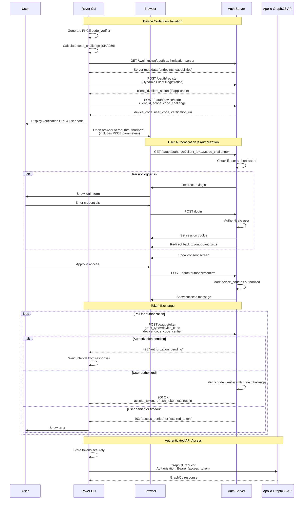
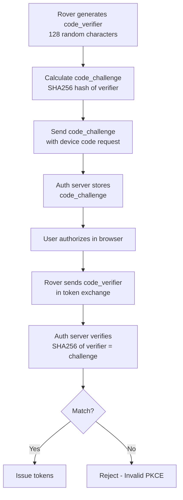

# OAuth 2.1 Device Code Flow with PKCE - Rover CLI Implementation

## Overview

This document describes the OAuth 2.1 Device Authorization Grant (RFC 8628) implementation with PKCE (RFC 7636) for the Apollo Rover CLI. This POC implementation demonstrates how Rover can authenticate users via OAuth 2.1 for secure access to Apollo GraphOS resources without requiring direct credential entry in the CLI.

## Table of Contents
- [Architecture Overview](#architecture-overview)
- [Implementation Status](#implementation-status)
- [OAuth Flow Diagram](#oauth-flow-diagram)
- [What Rover Implements](#what-rover-implements)
- [Frontend/UI Requirements](#frontendui-requirements)
- [Authorization Server Requirements](#authorization-server-requirements)
- [Security Considerations](#security-considerations)
- [Testing the POC](#testing-the-poc)
- [Production Implementation Checklist](#production-implementation-checklist)

## Architecture Overview

The implementation consists of three main components:

1. **Rover CLI (This POC)**: The device/CLI application requesting access
2. **Frontend/Browser**: Where the user authenticates and authorizes
3. **Authorization Server**: Handles OAuth flows, authentication, and token issuance

### Key RFCs Implemented
- **RFC 8628**: OAuth 2.1 Device Authorization Grant
- **RFC 7636**: Proof Key for Code Exchange (PKCE)
- **RFC 8414**: OAuth 2.0 Authorization Server Metadata
- **RFC 7591**: OAuth 2.0 Dynamic Client Registration

## Implementation Status

### ✅ Completed in POC
- Device Code Flow client implementation (`rover-oauth` crate)
- PKCE code challenge generation (SHA256)
- Authorization server metadata discovery
- Dynamic client registration support
- Mock OAuth server for testing
- CLI UX for OAuth flow (`rover config oauth-test`)
- Proper OAuth 2.1 URL generation

### 🚧 Required for Production
- Secure token storage
- Token refresh implementation
- Revocation support
- Error recovery and retry logic
- Production authorization server endpoints
- Frontend OAuth consent UI
- Security hardening

## OAuth Flow Diagram

### Device Code Flow with PKCE



### PKCE Flow Detail



## What Rover Implements

### 1. OAuth Client (`rover-oauth` crate)

#### Core Components

**`DeviceFlowClient`** - Main OAuth client implementation
```rust
pub struct DeviceFlowClient {
    client: reqwest::Client,
    config: OAuthClientConfig,
}
```

**Key Methods:**
- `discover_metadata()`: Discovers OAuth server capabilities via `.well-known`
- `register_client()`: Dynamic client registration (RFC 7591)
- `start_device_flow()`: Initiates device authorization with PKCE
- `poll_for_token()`: Polls for user authorization completion
- `exchange_token()`: Exchanges device code for access token

#### PKCE Implementation
```rust
// Code verifier: 128 random characters (RFC 7636)
let code_verifier = generate_code_verifier()?; // [A-Z][a-z][0-9]

// Code challenge: SHA256(code_verifier)
let code_challenge = calculate_code_challenge(&code_verifier)?;

// Send challenge with authorization request
// Send verifier with token exchange
```

### 2. CLI Integration (`rover config oauth-test`)

The POC command demonstrates the complete flow:

1. **Initialization**
   ```bash
   cargo run -- config oauth-test [--client-id <id>] [--studio-url <url>]
   ```

2. **Flow Steps**
   - Generates PKCE parameters
   - Discovers OAuth endpoints
   - Registers client (if needed)
   - Starts device flow
   - Opens browser to authorization URL
   - Polls for completion
   - Stores tokens (mocked in POC)

3. **User Experience**
   ```
   Welcome to Rover
   
   Browser didn't open? Use the url below to sign in:
   
   http://localhost:3000/oauth/authorize?client_id=rover-cli...
   
   POC: This URL follows proper OAuth 2.1 standards.
   The OAuth server will handle the complete flow:
     1. Redirect to login if user not authenticated
     2. Show OAuth consent screen for Rover CLI
     3. Handle authorization code exchange with PKCE
     4. Return access token to complete the flow
   
   Waiting for authorization completion...
   ✅ Successfully authenticated with Apollo Studio!
   ```

### 3. Mock Server Implementation

For POC testing, includes a mock OAuth server that simulates:
- Server metadata endpoint
- Client registration
- Device code issuance
- Authorization simulation
- Token exchange with PKCE verification

## Frontend/UI Requirements

### Authorization Page (`/oauth/authorize`)

The frontend must handle the authorization URL with these query parameters:

```
http://localhost:3000/oauth/authorize?
  client_id=rover-cli-abc123              # Client identifier
  response_type=code                      # Authorization code flow
  redirect_uri=http://...                 # Where to redirect after
  scope=rover                             # Requested permissions
  code_challenge=E9Melhoa2Owv...         # PKCE challenge (base64url)
  code_challenge_method=S256              # SHA256 method
  state=862095a7-205d-4868...            # CSRF protection
```

#### Frontend Flow:

1. **Parse OAuth Parameters**
   ```javascript
   const params = new URLSearchParams(window.location.search);
   const clientId = params.get('client_id');
   const codeChallenge = params.get('code_challenge');
   const state = params.get('state');
   // Store these for later verification
   ```

2. **Check Authentication**
   ```javascript
   if (!userAuthenticated) {
     // Store OAuth params in session
     sessionStorage.setItem('oauth_params', JSON.stringify({
       clientId, codeChallenge, state, ...
     }));
     // Redirect to login
     window.location.href = `/login?from=${encodeURIComponent(window.location.href)}`;
   }
   ```

3. **Display Consent Screen**
   ```javascript
   // After authentication, show consent UI
   <ConsentScreen 
     clientName="Apollo Rover CLI"
     scopes={['rover']}
     onApprove={handleApprove}
     onDeny={handleDeny}
   />
   ```

4. **Handle Approval**
   ```javascript
   async function handleApprove() {
     // Link device_code to user authorization
     const response = await fetch('/oauth/authorize/confirm', {
       method: 'POST',
       headers: {
         'Content-Type': 'application/json',
         'Authorization': `Bearer ${sessionToken}`
       },
       body: JSON.stringify({
         client_id: clientId,
         code_challenge: codeChallenge,
         state: state,
         approved: true
       })
     });
     
     // Show success message
     showSuccessUI();
   }
   ```

### Login Page (`/login`)

If user is not authenticated:

1. **Preserve OAuth Context**
   ```javascript
   // Get the 'from' parameter
   const from = new URLSearchParams(window.location.search).get('from');
   
   // After successful login
   if (from && from.includes('/oauth/authorize')) {
     window.location.href = from; // Return to OAuth flow
   }
   ```

2. **Security Checks**
   - Validate redirect URLs
   - Prevent open redirects
   - Check OAuth parameters integrity

## Authorization Server Requirements

### Required Endpoints

1. **`/.well-known/oauth-authorization-server`**
   ```json
   {
     "issuer": "http://localhost:3000",
     "device_authorization_endpoint": "http://localhost:3000/oauth/device/code",
     "token_endpoint": "http://localhost:3000/oauth/token",
     "registration_endpoint": "http://localhost:3000/oauth/register",
     "authorization_endpoint": "http://localhost:3000/oauth/authorize",
     "token_endpoint_auth_methods_supported": ["none", "client_secret_post"],
     "grant_types_supported": ["urn:ietf:params:oauth:grant-type:device_code"],
     "code_challenge_methods_supported": ["S256"]
   }
   ```

2. **`POST /oauth/register`** (Dynamic Client Registration)
   ```json
   Request:
   {
     "client_name": "Apollo Rover CLI",
     "grant_types": ["urn:ietf:params:oauth:grant-type:device_code"],
     "scope": "rover"
   }
   
   Response:
   {
     "client_id": "rover-cli-abc123",
     "client_id_issued_at": 1704067200,
     "grant_types": ["urn:ietf:params:oauth:grant-type:device_code"]
   }
   ```

3. **`POST /oauth/device/code`** (Start Device Flow)
   ```json
   Request:
   {
     "client_id": "rover-cli-abc123",
     "scope": "rover",
     "code_challenge": "E9Melhoa2OwvFrEMTJguCHaoeK1t8URWbuGJSstw-cM",
     "code_challenge_method": "S256"
   }
   
   Response:
   {
     "device_code": "GmRhmhcxhwAzkoEqiMEg_DnyEysNkuNhszIySk9eS",
     "user_code": "WDJB-MJHT",
     "verification_uri": "http://localhost:3000/device",
     "verification_uri_complete": "http://localhost:3000/device?user_code=WDJB-MJHT",
     "expires_in": 1800,
     "interval": 5
   }
   ```

4. **`POST /oauth/token`** (Token Exchange)
   ```json
   Request:
   {
     "grant_type": "urn:ietf:params:oauth:grant-type:device_code",
     "device_code": "GmRhmhcxhwAzkoEqiMEg_DnyEysNkuNhszIySk9eS",
     "client_id": "rover-cli-abc123",
     "code_verifier": "dBjftJeZ4CVP-mB92K27uhbUJU1p1r_wW1gFWFOEjXk..."
   }
   
   Response (when authorized):
   {
     "access_token": "SlAV32hkKG...",
     "token_type": "Bearer",
     "expires_in": 3600,
     "refresh_token": "8xLOxBtZp8",
     "scope": "rover"
   }
   
   Response (when pending):
   {
     "error": "authorization_pending",
     "error_description": "The authorization request is still pending"
   }
   ```

### Server-Side PKCE Verification

```python
# When device code is created
device_codes[device_code] = {
    'code_challenge': request['code_challenge'],
    'code_challenge_method': request['code_challenge_method'],
    'client_id': request['client_id'],
    'status': 'pending',
    'expires_at': time.time() + 1800
}

# When token is requested
def verify_pkce(device_code, code_verifier):
    stored = device_codes.get(device_code)
    if not stored:
        return False
    
    # Calculate challenge from verifier
    challenge = base64url_encode(
        hashlib.sha256(code_verifier.encode()).digest()
    ).rstrip('=')
    
    # Compare with stored challenge
    return challenge == stored['code_challenge']
```

### Authorization Linking

When user approves in browser:

```python
# Link the device_code to the user's authorization
def approve_device(user_id, client_id, code_challenge):
    # Find pending device code with matching client_id and challenge
    for device_code, data in device_codes.items():
        if (data['client_id'] == client_id and 
            data['code_challenge'] == code_challenge and
            data['status'] == 'pending'):
            
            # Mark as authorized
            data['status'] = 'authorized'
            data['user_id'] = user_id
            data['authorized_at'] = time.time()
            return True
    
    return False
```

## Security Considerations

### 1. PKCE Requirements
- **Code Verifier**: Must be cryptographically random, 43-128 characters
- **Code Challenge**: Must use SHA256 (S256 method)
- **One-time use**: Challenges must not be reusable

### 2. Token Security
- **Storage**: Use OS keychain/credential manager
- **Transmission**: Always use HTTPS in production
- **Rotation**: Implement refresh token rotation
- **Revocation**: Support token revocation

### 3. Client Security
- **Client ID**: Should be unique per installation (dynamic registration)
- **No embedded secrets**: Public clients cannot securely store secrets
- **Rate limiting**: Implement polling backoff

### 4. Browser Security
- **CSRF Protection**: Verify `state` parameter
- **Redirect validation**: Prevent open redirects
- **Session fixation**: Generate new sessions on login
- **Content Security Policy**: Restrict resource loading

## Running the OAuth POC

### Development Environment Setup

#### Prerequisites
- Rust development environment
- Local OAuth server running on localhost (or use mock server)
- Browser for OAuth authorization flow

#### Security Configuration for Development

The implementation enforces HTTPS by default for security. To enable HTTP for local development:

```bash
# Set environment variable to allow HTTP (development only!)
export ROVER_OAUTH_ALLOW_HTTP=1

# You'll see a warning when using HTTP:
# WARNING: Using insecure HTTP for OAuth. This should only be used for local development!
```

### Running in Development

#### 1. Basic OAuth Flow Test
```bash
# Enable HTTP for localhost development
ROVER_OAUTH_ALLOW_HTTP=1 cargo run -- config oauth-test

# Output will show:
# - Generated PKCE challenge (cryptographically secure)
# - OAuth authorization URL with all parameters
# - Browser opens automatically
# - Success message after authorization
```

#### 2. Test with Custom OAuth Server
```bash
# Use a different localhost port
ROVER_OAUTH_ALLOW_HTTP=1 cargo run -- config oauth-test --studio-url http://localhost:4000

# Use a custom client ID
ROVER_OAUTH_ALLOW_HTTP=1 cargo run -- config oauth-test --client-id my-test-client-id
```

#### 3. Test with Mock Server (POC Only)
```bash
# The mock server simulates the complete OAuth flow
ROVER_OAUTH_ALLOW_HTTP=1 cargo run -- config oauth-test

# The mock will:
# - Auto-generate client IDs
# - Simulate device authorization
# - Auto-approve after brief delay
# - Generate mock tokens
```

#### 4. Debug Mode
```bash
# Enable debug logging
RUST_LOG=debug ROVER_OAUTH_ALLOW_HTTP=1 cargo run -- config oauth-test

# See OAuth flow details including:
# - PKCE generation
# - HTTP requests (without sensitive data)
# - Token exchange process
```

### Security Features in POC

1. **Cryptographically Secure PKCE**
   - Uses OS random number generator
   - 256 bits of entropy
   - Fresh values for each session

2. **HTTPS Enforcement**
   - HTTPS required by default
   - HTTP only allowed for localhost with explicit env var
   - Certificate validation enabled

3. **No Hardcoded Secrets**
   - All values dynamically generated
   - No reusable credentials in code

4. **Sanitized Error Messages**
   - Sensitive data removed from errors
   - User-friendly error messages

### Running in Production (Hypothetical)

#### Prerequisites for Production
- HTTPS-enabled OAuth server
- Proper TLS certificates
- Production client registration
- Token storage backend (OS keychain)

#### Production Configuration

```bash
# 1. Build with OAuth feature
cargo build --release --features oauth

# 2. Configure for production OAuth server
rover config oauth \
  --profile production \
  --studio-url https://studio.apollographql.com

# 3. The flow will:
#    - Use HTTPS exclusively (no HTTP option)
#    - Validate TLS certificates
#    - Store tokens securely in OS keychain
#    - Handle token refresh automatically
```

#### Production Security Checklist

✅ **Before Production Deployment:**
- [ ] Remove `ROVER_OAUTH_ALLOW_HTTP` support
- [ ] Enable certificate pinning for known hosts
- [ ] Implement secure token storage
- [ ] Add audit logging
- [ ] Configure rate limiting
- [ ] Set up monitoring/alerting
- [ ] Security scan all dependencies
- [ ] Penetration test OAuth flow

#### Production Commands (Future Implementation)

```bash
# Authenticate with OAuth
rover auth login --oauth

# Check authentication status
rover auth status

# Refresh tokens (automatic, but can force)
rover auth refresh

# Logout and revoke tokens
rover auth logout

# Use authenticated commands
rover graph check my-graph@current \
  --profile production  # Uses OAuth tokens
```

### Troubleshooting

#### Common Development Issues

1. **"OAuth server URL must use HTTPS" Error**
   ```bash
   # Solution: Enable HTTP for local development
   export ROVER_OAUTH_ALLOW_HTTP=1
   ```

2. **Browser Doesn't Open**
   ```bash
   # Manually copy the URL from terminal
   # Look for: "Browser didn't open? Use the url below to sign in:"
   ```

3. **PKCE Verification Fails**
   ```bash
   # Ensure you're using the latest code
   # PKCE values are now dynamically generated
   ```

4. **Network Errors**
   ```bash
   # Check if OAuth server is running
   curl http://localhost:3000/.well-known/oauth-authorization-server
   ```

### Testing OAuth Security

```bash
# 1. Verify HTTPS enforcement
cargo run -- config oauth-test --studio-url http://example.com
# Should fail without ROVER_OAUTH_ALLOW_HTTP

# 2. Test PKCE uniqueness
ROVER_OAUTH_ALLOW_HTTP=1 cargo run -- config oauth-test
# Each run generates unique PKCE values

# 3. Verify error sanitization
# Errors should not contain tokens or sensitive data
```

## Production Implementation Checklist

### Rover CLI Tasks
- [ ] Implement secure token storage using OS keychain
- [ ] Add token refresh logic with rotation
- [ ] Implement proper error handling and retry logic
- [ ] Add token revocation support
- [ ] Remove mock server code
- [ ] Add comprehensive logging (without leaking secrets)
- [ ] Implement timeout handling
- [ ] Add offline access scope support
- [ ] Support multiple Apollo organizations
- [ ] Add `rover auth logout` command
- [ ] Add `rover auth status` command
- [ ] Integrate with existing Rover commands

### Frontend Tasks
- [ ] Implement `/oauth/authorize` page
- [ ] Add consent screen UI
- [ ] Handle login redirects properly
- [ ] Implement PKCE verification
- [ ] Add device code display option
- [ ] Show clear authorization success
- [ ] Handle errors gracefully
- [ ] Add revocation UI
- [ ] Support organization selection
- [ ] Add security headers

### Backend Tasks
- [ ] Implement all OAuth 2.1 endpoints
- [ ] Add PKCE verification
- [ ] Implement device code storage
- [ ] Add rate limiting
- [ ] Implement token rotation
- [ ] Add audit logging
- [ ] Support dynamic client registration
- [ ] Add monitoring and metrics
- [ ] Implement revocation endpoint
- [ ] Add admin interface

### Security Tasks
- [ ] Security audit of implementation
- [ ] Penetration testing
- [ ] Token encryption at rest
- [ ] Implement key rotation
- [ ] Add intrusion detection
- [ ] Review OWASP guidelines
- [ ] Implement security headers
- [ ] Add vulnerability scanning
- [ ] Document security model
- [ ] Incident response plan

## References

- [RFC 8628: OAuth 2.0 Device Authorization Grant](https://datatracker.ietf.org/doc/html/rfc8628)
- [RFC 7636: Proof Key for Code Exchange](https://datatracker.ietf.org/doc/html/rfc7636)
- [RFC 8414: OAuth 2.0 Authorization Server Metadata](https://datatracker.ietf.org/doc/html/rfc8414)
- [RFC 7591: OAuth 2.0 Dynamic Client Registration](https://datatracker.ietf.org/doc/html/rfc7591)
- [OAuth 2.1 Draft](https://datatracker.ietf.org/doc/html/draft-ietf-oauth-v2-1-10)
- [Apollo GraphOS Documentation](https://www.apollographql.com/docs/graphos/)
- [Model Context Protocol](https://github.com/modelcontextprotocol/protocol)

## Support

For questions about this implementation:
- Review the mock server code for reference implementation
- Check the test command for integration patterns
- See inline TODOs for production considerations
- Consult the OAuth RFCs for specification details

---

*This POC demonstrates the complete OAuth 2.1 Device Code Flow with PKCE for Rover CLI. The implementation prioritizes security, follows OAuth standards, and provides a foundation for production deployment.*