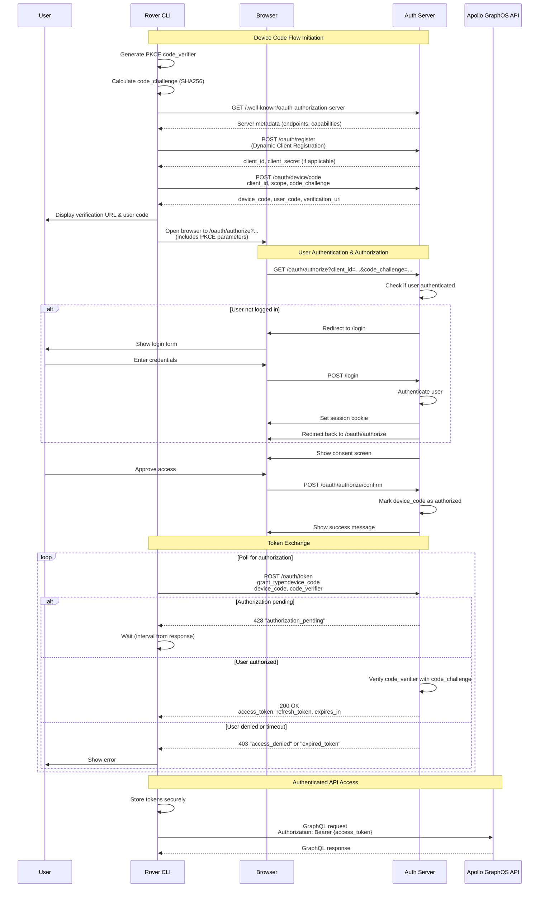

# OAuth 2.1 Device Code Flow with PKCE - Complete Flow Diagram

This diagram shows the complete OAuth 2.1 Device Authorization Grant flow with PKCE implementation between Rover CLI, the browser, and the authorization server.

## Key Flow Steps

1. **Device Code Flow Initiation**: Rover generates PKCE parameters and discovers OAuth endpoints
2. **User Authentication & Authorization**: User logs in (if needed) and approves OAuth consent
3. **Token Exchange**: Rover polls for authorization completion and receives access tokens
4. **Authenticated API Access**: Rover uses the access token for GraphOS API requests

## Security Features

- **PKCE**: Protects against code interception attacks
- **Dynamic Client Registration**: No hardcoded client secrets
- **Polling with Backoff**: Prevents server overload
- **State Parameter**: CSRF protection for browser flows