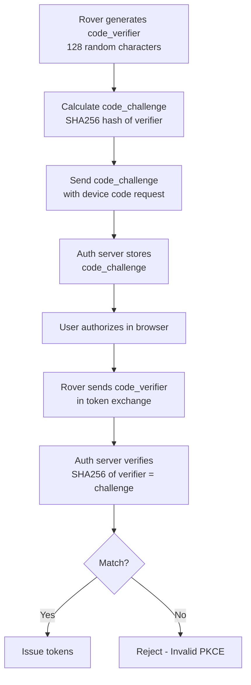

# PKCE (Proof Key for Code Exchange) Flow Diagram

This diagram illustrates the PKCE implementation details for OAuth 2.1 Device Code Flow, showing how the code verifier and code challenge are generated, transmitted, and verified.

## PKCE Security Benefits

1. **Protection Against Code Interception**: Even if an authorization code is intercepted, it cannot be exchanged for tokens without the code verifier
2. **No Client Secret Required**: Public clients (like CLI tools) don't need to store secrets
3. **Dynamic Security**: Each OAuth flow uses unique PKCE parameters
4. **RFC 7636 Compliance**: Follows official PKCE specification

## Implementation Details

- **Code Verifier**: 128 cryptographically random characters (43-128 allowed by RFC)
- **Code Challenge**: Base64url-encoded SHA256 hash of the code verifier
- **Challenge Method**: Always "S256" (SHA256) for maximum security
- **Verification**: Server calculates SHA256 of received verifier and compares with stored challenge

## Security Requirements

- Code verifier must be cryptographically random
- Code verifier must be unique for each authorization request
- Code challenge must be transmitted but code verifier must be kept secret until token exchange
- Server must validate PKCE parameters before issuing tokens