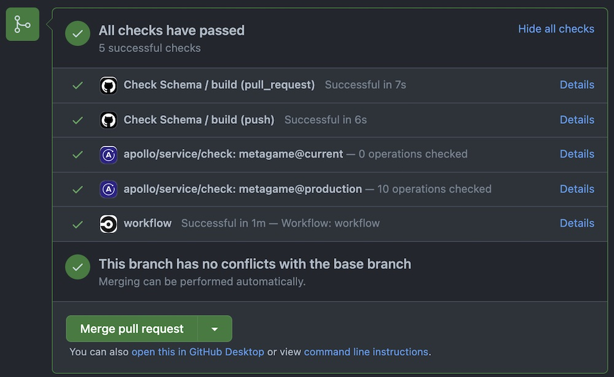

You can use Rover in any CI/CD environment that uses a Rover-supported operating system (Linux, MacOS, or Windows). Most commonly, this is to run [schema checks](/graphos/delivery/schema-checks/) with [`rover graph check`](./commands/graphs/#checking-schema-changes) or [`rover subgraph check`](./commands/subgraphs/#checking-subgraph-schema-changes).

Rover's installation is similar to many other CLI tools, but the recommended method varies depending on which provider you're using. We've included instructions for some of the most common CI/CD providers:

* [CircleCI](#circleci)
* [GitHub Actions](#github-actions)
* [Bitbucket Pipelines](#bitbucket-pipelines)
* [Jenkins](#jenkins)
* [Gitlab CI/CD](#gitlab-cicd)

If you're using Rover with a CI/CD provider not listed here, we'd love for you to share the steps by opening an [issue](https://github.com/apollographql/rover/issues/new/choose) or [pull request](https://github.com/apollographql/rover/compare).

## CircleCI

### Linux jobs using the `curl` installer

Normally when installing, Rover adds the path of its executable to your `$PATH`. However, CircleCI doesn't use the `$PATH` variable between run `step`s. This means that if you install Rover and try to run it in the next step, you get a `command not found: rover` error.

To fix this, you can modify the `$PATH` and append it to [`$BASH_ENV`](https://circleci.com/docs/2.0/env-vars/#setting-an-environment-variable-in-a-shell-command). `$BASH_ENV` is executed at the beginning of each step, enabling any changes to be maintained across steps. You can add Rover to your `$PATH` using `$BASH_ENV` like this:

```bash
echo 'export PATH=$HOME/.rover/bin:$PATH' >> $BASH_ENV
```

After you install Rover and modify the `$BASH_ENV` as shown, Rover should work like normal.

<Note>

Because the `rover config auth` command is interactive, you need to [authenticate using an environment variable](./configuring#with-an-environment-variable) in your project settings.

</Note>

#### Full example

```yaml
# Use the latest 2.1 version of CircleCI pipeline process engine. See: https://circleci.com/docs/2.0/configuration-reference
version: 2.1

jobs:
  build:
    docker:
      - image: cimg/node:15.11.0
    steps:
      - run:
          name: Install
          command: |
            # download and install Rover
            curl -sSL https://rover.apollo.dev/nix/v0.26.3 | sh

            # This allows the PATH changes to persist to the next `run` step
            echo 'export PATH=$HOME/.rover/bin:$PATH' >> $BASH_ENV
      - checkout
      # after rover is installed, you can run it just like you would locally!
      # only run this command with the `--background` flag if you have the Apollo Studio GitHub integration enabled on your repository
      - run: rover graph check my-graph@prod --schema ./schema.graphql --background
```

## GitHub Actions

### Displaying schema check results on GitHub pull requests

If you use GitHub Actions to automatically run [schema checks](/graphos/delivery/schema-checks/) on every pull request ([as shown below](#full-example-1)), you can install the [Apollo Studio GitHub app](https://github.com/marketplace/apollo-studio) to provide links to the results of those checks alongside your other pull request checks:



<SetApolloVCSCommit />

### Linux/MacOS jobs using the `curl` installer

Normally when installing, Rover adds the path of its executable to your `$PATH`. However, GitHub Actions doesn't use the `$PATH` variable between run `step`s. This means that if you install Rover and try to run it in the next step, you get a `command not found: rover` error.

To fix this, you can append Rover's location to the [`$GITHUB_PATH`](https://docs.github.com/en/actions/reference/workflow-commands-for-github-actions#adding-a-system-path) variable. `$GITHUB_PATH` is similar to your system's `$PATH` variable, and additions to `$GITHUB_PATH` can be used across multiple steps. You can modify it like this:

```bash
echo "$HOME/.rover/bin" >> $GITHUB_PATH
```

<Note>

Because the `rover config auth` command is interactive, you need to [authenticate using an environment variable](./configuring#with-an-environment-variable) in your project settings.

GitHub actions uses [project environments](https://docs.github.com/en/actions/reference/environments) to set up secret environment variables. In your action, you choose a `build.environment` by name and set `build.env` variables using the saved secrets.

</Note>

The following is a full example script, showing how to choose an `apollo` environment and set an `APOLLO_KEY` variable:


#### Full example

```yaml
# .github/workflows/check.yml

name: Check Schema

# Controls when the action will run. Triggers the workflow on push or pull request events
on: [push, pull_request]

# A workflow run is made up of one or more jobs that can run sequentially or in parallel
jobs:
  # This workflow contains a single job called "build"
  build:
    # The type of runner that the job will run on
    runs-on: ubuntu-latest

    # https://docs.github.com/en/actions/reference/environments
    environment: apollo

    # https://docs.github.com/en/actions/reference/encrypted-secrets
    # https://docs.github.com/en/actions/reference/workflow-syntax-for-github-actions#jobsjob_idstepsenv
    env:
      APOLLO_KEY: ${{ secrets.APOLLO_KEY }}
      APOLLO_VCS_COMMIT: ${{ github.event.pull_request.head.sha }}

    # Steps represent a sequence of tasks that will be executed as part of the job
    steps:
      # Checks-out your repository under $GITHUB_WORKSPACE, so your job can access it
      - uses: actions/checkout@v2

      - name: Install Rover
        run: |
          curl -sSL https://rover.apollo.dev/nix/v0.26.3 | sh

          # Add Rover to the $GITHUB_PATH so it can be used in another step
          # https://docs.github.com/en/actions/reference/workflow-commands-for-github-actions#adding-a-system-path
          echo "$HOME/.rover/bin" >> $GITHUB_PATH
      # only run this command with the `--background` flag if you have the Apollo Studio GitHub integration enabled on your repository
      - name: Run check against prod
        run: |
          rover graph check my-graph@prod --schema ./test.graphql --background

```

## Bitbucket Pipelines

The following is a full example configuration for Bitbucket Pipelines. It shows how to:

* Run `rover subgraph check` for each commit on all branches
* Run `rover subgraph publish` to keep the schema definition of your `main` branch in-sync with a base variant (`@local` in this case)

The example uses the following Pipeline Repository Variables to make the pipeline configuration portable across different repositories:

*  `APOLLO_KEY`
*  `APOLLO_SUBGRAPH_NAME`, which represents the name of the subgraph you're running schema checks for
*  `APOLLO_LOCAL_PORT`, which represents the port number of the base variant

#### Full example

```yaml
# ./bitbucket-pipelines.yml

image: node

definitions:
  steps:
    - step: &rover-subgraph-check
        name: "[Rover] Subgraph Check"
        caches:
          - node
        script:
          - 'echo "Subgraph name: $APOLLO_SUBGRAPH_NAME"'
          - npx -p @apollo/rover@latest
            rover subgraph check my-graph@prod
            --name $APOLLO_SUBGRAPH_NAME
            --schema ./schema.graphql

    - step: &local-publish
        name: "[Rover] @local publish (sync with main/master)"
        caches:
          - node
        script:
          - 'echo "Subgraph name: $APOLLO_SUBGRAPH_NAME"'
          - 'echo "Local variant port: $APOLLO_LOCAL_PORT"'

          - npx -p @apollo/rover@latest
            rover subgraph publish my-graph@local
            --name $APOLLO_SUBGRAPH_NAME
            --schema ./schema.graphql
            --routing-url http://localhost:$APOLLO_LOCAL_PORT/graphql

pipelines:
  default:
    - step: *rover-subgraph-check

  branches:
    '{main,master}':
      - step: *rover-subgraph-check
      - step: *local-publish
```


## Jenkins
To set up Rover for use with Jenkins, first consider which type of Jenkins `agent` you'll use in your pipelines. The samples below demonstrate a golang pipeline that uses Docker, but you can modify them to meet your specific needs.

### Distributed builds via the `node` agent
If you're running a distributed build system using the `node` agent type, make sure that Rover is installed on all machines either as part of a baseline image or via a setup script. Also make sure it's available globally via the `PATH` environment variable.

### Pipelines using Docker

If you're using Rover with a Docker-enabled pipeline, note the following additional considerations:

#### `$PATH` issues

Normally when installing, Rover adds the path of its executable to your `$PATH`. However, Jenkins doesn't persist the `$PATH` variable between runs of `sh` `steps`, because each `sh` block runs as its own process. This means that if you install Rover and try to run it in the next step, you get a `command not found: rover` error. This is functionally similar to the [CircleCI note](#linux-jobs-using-the-curl-installer), but the resolution is different.

To avoid this issue, do one of the following:
- Use the script, but reference `rover` by its full path (`$HOME/.rover/bin/rover`)
- Download the latest release via cURL and extract the binary like so (this downloads Rover `0.23.0` for Linux x86 architectures):

    ```
    curl -L https://github.com/apollographql/rover/releases/download/v0.26.3/rover-v0.26.3-x86_64-unknown-linux-gnu.tar.gz | tar --strip-components=1 -zxv
    ```

#### Permission issues

If you run into permissions issues within Docker, you can resolve many of them by creating a user to run the install and build processes. The example Dockerfile below shows how to accomplish this with a specific Docker image for your Jenkins build pipeline:

```dockerfile
FROM golang:1.18
RUN useradd -m rover && echo "rover:rover" | chpasswd
USER rover
RUN curl -sSL https://rover.apollo.dev/nix/latest | sh
```

### Jenkinsfile Configuration

After you've installed Rover appropriately, you can execute the `rover` command within a `sh` step, as shown in the example configuration below. Because `rover` outputs logs via stderr and emits proper status codes, it generates build errors if the `rover subgraph check` command fails.

We recommend passing arguments to `rover` commands via environment variables. This enables you to reuse large portions of your pipeline, making it faster to onboard new subgraphs without rewriting code.

Additionally, we strongly recommend passing in the `APOLLO_KEY` by using a Jenkins credential and referencing it using `credentials(key_name)` within your `jenkinsfile`. An example of this is below.

```groovy
pipeline {
  agent {
    dockerfile {
      filename './build_artifacts/Dockerfile'
    }

  }
  stages {
    stage('Rover Check') {
      steps {
        sh '''echo "Subgraph: $APOLLO_SUBGRAPH_NAME
        $HOME/.rover/bin/rover subgraph check $APOLLO_GRAPH_REF --name $APOLLO_SUBGRAPH_NAME --schema $SCHEMA_PATH'''
      }
    }

    stage('Build') {
      steps {
        sh 'go build .'
      }
    }

    stage('Go Test') {
      steps {
        sh 'go test ./... -v'
      }
    }

    stage('Schema Publish to Dev') {
      when {
        expression { env.BRANCH_NAME == 'main' }
      }
      steps {
        sh '$HOME/.rover/bin/rover subgraph publish $APOLLO_GRAPH_REF --name $APOLLO_SUBGRAPH_NAME --schema $SCHEMA_PATH'
      }
    }

  }
  environment {
    APOLLO_KEY = credentials('apollo_key')
    APOLLO_SUBGRAPH_NAME = 'products'
    APOLLO_CONFIG_HOME = '~/.config/rover'
    SCHEMA_PATH = './graph/schema.graphqls'
    APOLLO_GRAPH_REF = 'AolloJenkins@dev'
  }
}
```
## Gitlab
Since there isn't any official Docker image for Rover, we can use the `debian:stable-slim` as a base image. All you need to do is fetch the source via cURL, add the executable to the PATH variable, then publish your subgraphs. 

```
push_subgraphs:
stages:
  - publish_subgraphs
  
publish_subgraphs:
  stage: publish_subgraphs
  image: debian:stable-slim
  retry: 1 # to retry if any connection issue or such happens
  before_script:
    - apt-get update && apt-get install curl -y
  script:
    - curl -sSL https://rover.apollo.dev/nix/latest | sh # Install the latest version of Rover
    - export PATH="$HOME/.rover/bin:$PATH" # Manually add it to the ruuner PATH
    - export APOLLO_KEY=$APOLLO_FEDERATION_KEY
    - rover subgraph publish $APOLLO_GRAPH_REF --name $APOLLO_SUBGRAPH_NAME --schema $SCHEMA_PATH
```

## Using With `npm`/`npx`

If you're running in a Node.js workflow, it might be easier to use the [NPM distribution of Rover](https://www.npmjs.com/package/@apollo/rover). This way, you don't need to adjust the PATH at all to run Rover, and it might fit better into your existing workflow.

You can use Rover by adding it to your `package.json` dependencies using [these instructions](./getting-started#npm-installer) and then execute it using npm scripts, similar to other workflows you might already have. If you don't want to install Rover as a dependency, you can run it with `npx` by using the `-p` flag:

<Note>

Only run this command with the `--background` flag if you have the Apollo Studio GitHub integration enabled on your repository.

</Note>

```bash
npx -p @apollo/rover rover graph check my-graph@prod --schema=./schema.graphql --background
```

Since most commands require you be authenticated, see the above sections for instructions on how to add environment variables for your CI/CD provider.
