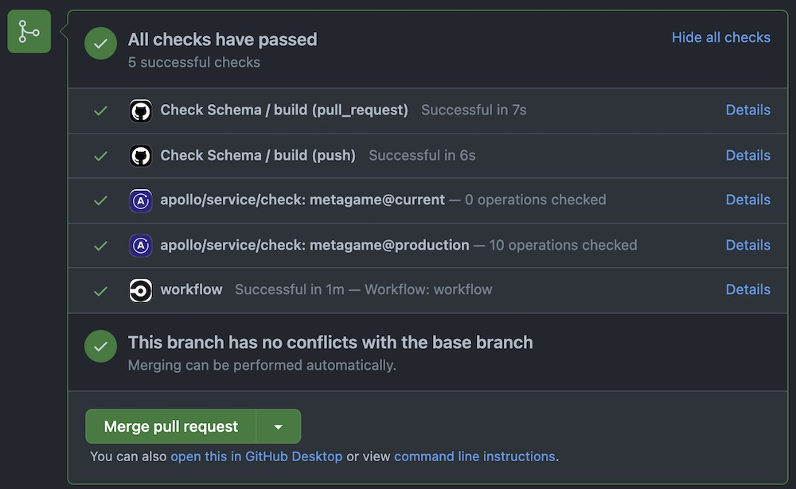

You can use Rover in any CI/CD environment that uses a Rover-supported operating system (Linux, macOS, or Windows). Most commonly, this is to run [schema checks](/graphos/delivery/schema-checks/) with [`rover graph check`](./commands/graphs/#checking-schema-changes) or [`rover subgraph check`](./commands/subgraphs/#checking-subgraph-schema-changes).

Apollo distributes Rover in three forms that are well-suited to CI:

- **Official Docker images** on [Docker Hub](https://hub.docker.com/r/apollograph/rover) and [GitHub Container Registry](https://github.com/apollographql/rover/pkgs/container/rover), with immutable tags pinned to each Rover release.
- **Apollo-published GitHub Actions** on the [GitHub Actions Marketplace](https://github.com/marketplace?query=apollographql-gh-actions+Rover&type=actions), with one action per common Rover CI command. The Docker-based actions run inside the official image, so the Rover version is pinned to the action's release tag.
- **Native binary installers** for Linux, macOS, and Windows. These are useful when Docker isn't available, when you need to run Rover on a non-Linux CI runner, or when you want to invoke Rover commands that don't have a dedicated action.

The rest of this page covers each option in detail, including end-to-end examples for the most common CI/CD providers:

- [GitHub Actions](#github)
- [CircleCI](#circleci)
- [Bitbucket Pipelines](#bitbucket-pipelines)
- [Jenkins](#jenkins)
- [GitLab CI/CD](#gitlab)

If you're using Rover with a CI/CD provider not listed here, we'd love for you to share the steps by opening an [issue](https://github.com/apollographql/rover/issues/new/choose) or [pull request](https://github.com/apollographql/rover/compare).

## Use API keys

Rover commands that communicate with [GraphOS](/graphos/) require an [API key](/graphos/platform/access-management/api-keys). GraphOS supports graph API keys, subgraph API keys, and personal API keys.

On your local development machine, use a personal API key and provide it to Rover with the [`rover config auth` command](./configuring#via-the-auth-command).

In shared environments like CI, use a graph or subgraph API key and [set it as an environment variable](./configuring#supported-environment-variables).

## Choosing an integration method

| You're using… | Recommended approach |
| --- | --- |
| GitHub Actions | The [Apollo-published GitHub Actions](#apollo-published-github-actions) (`apollographql-gh-actions/*`). |
| Any other CI provider that can run a container as a step (CircleCI, Bitbucket Pipelines, GitLab CI/CD, Jenkins with a Docker agent, etc.) | The [official Rover Docker image](#docker-images). |
| Windows or macOS CI runners, environments without Docker, or commands not covered by a published action | The [native binary installer](./getting-started#installation-methods). |
| Node.js-based workflows | The [npm distribution](#using-with-npmnpx) (`@apollo/rover`). |

The Docker images and the lockstep GitHub Action tags are immutable per Rover release. Pin to a specific version (for example, `ghcr.io/apollographql/rover:0.39.1` or `apollographql-gh-actions/install-rover@rover-v0.39.1`) so your pipeline behavior doesn't change when a new Rover version ships.

## Docker images

Starting with Rover 0.39.1, Apollo publishes immutable Linux container images for every release. These images include the Rover binary as the default entry point running as a non-root user.

```bash
# GitHub Container Registry
docker pull ghcr.io/apollographql/rover:0.41.0

# Docker Hub
docker pull apollograph/rover:0.41.0
```

<Note>

Always pin to a specific Rover version (such as `0.39.1`) rather than a moving tag. Apollo enforces tag immutability per release, so a pinned tag is safe to use across long-lived pipelines.

</Note>

### Running a command

The default `ENTRYPOINT` is `rover`, so you can pass arguments to `docker run` directly:

```bash
docker run --rm \
  -e APOLLO_KEY \
  -v "$PWD:/workspace" -w /workspace \
  ghcr.io/apollographql/rover:0.41.0 \
  subgraph check my-graph@prod --name products --schema ./schema.graphql
```

- `-e APOLLO_KEY` forwards your API key from the host environment.
- `-v "$PWD:/workspace" -w /workspace` mounts your repo so Rover can read schema files. Inside the container, paths are relative to `/workspace`.

The recommended approach for most CI providers (CircleCI, Bitbucket Pipelines, GitLab CI/CD, Jenkins with a Docker agent) is to set the image at the job or step level. This allows Rover commands to run as if they were on the host — see the per-provider examples below.

## GitHub

<Note>

Remember to [authenticate using an environment variable](./configuring#with-an-environment-variable). GitHub Actions uses
[project environments](https://docs.github.com/en/actions/reference/environments) to set up secret environment variables.
In your action, you choose a `build.environment` by name and set `build.env` variables using the saved secrets.

</Note>

### Apollo-published GitHub Actions

Apollo publishes GitHub Actions for common Rover CI commands, plus an installer action for everything else. For full input documentation, see each action's Marketplace listing:

- [Installing Rover](https://github.com/marketplace/actions/install-apollo-rover-cli)
- [Running `rover persisted-queries publish`](https://github.com/marketplace/actions/run-apollo-rover-persisted-queries-publish)
- [Running `rover subgraph check`](https://github.com/marketplace/actions/run-apollo-rover-subgraph-check)
- [Running `rover subgraph lint`](https://github.com/marketplace/actions/run-apollo-rover-subgraph-lint)
- [Running `rover subgraph publish`](https://github.com/marketplace/actions/run-apollo-rover-subgraph-publish)

Starting with Rover v0.39.1, the per-command actions are immutable Docker container actions that run inside the official `ghcr.io/apollographql/rover` image. Each Rover release publishes a matching `@rover-v<version>` tag for every action, so a single tag pins both the action and the Rover binary it runs.

<Note>

Because the per-command actions are Docker container actions, they only run on Linux runners (for example, `ubuntu-latest`). To run Rover on macOS or Windows runners, use [`install-rover`](#installing-rover-on-non-linux-runners) plus a `run:` step instead.

</Note>

#### Full example using the Apollo-published GitHub Actions

```yaml
name: Rover Actions

# Controls when the action will run. Triggers the workflow on push or pull request events
on: [push, pull_request]

# A workflow run is made up of one or more jobs that can run sequentially or in parallel
jobs:
  # This workflow contains a single job called "build"
  build:
    # The type of runner that the job will run on
    runs-on: ubuntu-latest

    # https://docs.github.com/en/actions/reference/encrypted-secrets
    # https://docs.github.com/en/actions/reference/workflow-syntax-for-github-actions#jobsjob_idstepsenv
    env:
      APOLLO_KEY: ${{ secrets.APOLLO_KEY }}
      APOLLO_VCS_BRANCH: ${{ github.head_ref }}
      APOLLO_VCS_COMMIT: ${{ github.event.pull_request.head.sha }}

    steps:
      # Checks-out your repository under $GITHUB_WORKSPACE, so your job can access it
      - uses: actions/checkout@v4

      # Run a schema check against your graph
      - uses: apollographql-gh-actions/rover-subgraph-check@rover-v0.41.0
        with:
          apollo-key: ${{ secrets.APOLLO_KEY }}
          # This could also be provided via an environment variable or GitHub Action variable
          graph-ref: ${{ secrets.APOLLO_GRAPH_REF }}
          name: subgraph-name
          # If you use a code-first subgraph, you can generate the schema in another step for use with this action
          schema: ./path/to/schema.graphql
          # Only run this command with the `background` setting if you have the Apollo Studio GitHub integration enabled on your repository
          background: true

      # Lint the subgraph schema.
      - uses: apollographql-gh-actions/rover-subgraph-lint@rover-v0.41.0
        with:
          apollo-key: ${{ secrets.APOLLO_KEY }}
          # This could also be provided via an environment variable or GitHub Action variable
          graph-ref: ${{ secrets.APOLLO_GRAPH_REF }}
          name: subgraph-name
          # If you use a code-first subgraph, you can generate the schema in another step for use with this action
          schema: ./path/to/schema.graphql

      # Publish the subgraph to GraphOS
      - uses: apollographql-gh-actions/rover-subgraph-publish@rover-v0.41.0
        with:
          apollo-key: ${{ secrets.APOLLO_KEY }}
          # This could also be provided via an environment variable or GitHub Action variable
          graph-ref: ${{ secrets.APOLLO_GRAPH_REF }}
          name: subgraph-name
          # If you use a code-first subgraph, you can generate the schema in another step for use with this action
          schema: ./path/to/schema.graphql

          # If running the first time, you will need to pass the `routing-url` parameter to the publish action.
          # This URL is used for the Apollo Router to route requests to your subgraph.
          routing-url: http://localhost:4000/graphql
          # If the routing-url is invalid for one reason or another, you can also pass the `allow-invalid-routing-url` parameter to the publish action.
          allow-invalid-routing-url: true

          # If you are publishing to a Connectors-based subgraph, you can pass the `no-url` parameter to the publish action, which is equivalent to passing "" to `routing-url` and true to `allow-invalid-routing-url`.
          no-url: true

      # Publish persisted queries to GraphOS.
      - uses: apollographql-gh-actions/rover-persisted-queries-publish@rover-v0.41.0
        with:
          apollo-key: ${{ secrets.APOLLO_KEY }}
          graph-ref: ${{ secrets.APOLLO_GRAPH_REF }}
          for-client-name: example-publish
          manifest: ./path/to/persisted-queries-manifest.json

      # Target a list by graph-id + list-id instead of graph-ref:
      - uses: apollographql-gh-actions/rover-persisted-queries-publish@rover-v0.41.0
        with:
          apollo-key: ${{ secrets.APOLLO_KEY }}
          graph-id: ${{ vars.APOLLO_GRAPH_ID }}
          list-id: 1234-5678
          for-client-name: example-publish
          manifest: ./path/to/persisted-queries-manifest.json
```

#### Versioning the actions

- `@rover-v<version>` — runs the matching Rover release. Both the action and Rover are released as immutable artifacts, so no SHA pinning is needed.
- `@v1` — pre-lockstep tag for the install action; accepts a `version:` input. Use this only if you need a Rover version older than v0.39.1, or if you can't use the Docker-based per-command actions (for example, on a Windows or macOS runner).

#### Installing Rover on non-Linux runners

If your job runs on `macos-*` or `windows-*` runners, or if you want to invoke a Rover command that doesn't have a published action, use [`install-rover`](https://github.com/marketplace/actions/install-apollo-rover-cli) to put `rover` on `PATH` and then call it directly:

```yaml
jobs:
  check:
    runs-on: ubuntu-latest # works equally well on macos-latest / windows-latest
    env:
      APOLLO_KEY: ${{ secrets.APOLLO_KEY }}
    steps:
      - uses: actions/checkout@v4
      - uses: apollographql-gh-actions/install-rover@rover-v0.41.0
      - run: rover graph check my-graph@prod --schema ./schema.graphql --background
```

### Linux/macOS jobs using the `curl` installer

If you'd rather not depend on the Apollo-published action, you can install Rover with the shell installer. Note that GitHub Actions doesn't persist `$PATH` between `run` steps, so you must append Rover's bin directory to [`$GITHUB_PATH`](https://docs.github.com/en/actions/reference/workflow-commands-for-github-actions#adding-a-system-path):

```bash
echo "$HOME/.rover/bin" >> $GITHUB_PATH
```

#### Full example

```yaml
# .github/workflows/check.yml

name: Check Schema

# Controls when the action will run. Triggers the workflow on push or pull request events
on: [push, pull_request]

# A workflow run is made up of one or more jobs that can run sequentially or in parallel
jobs:
  # This workflow contains a single job called "build"
  build:
    # The type of runner that the job will run on
    runs-on: ubuntu-latest

    # https://docs.github.com/en/actions/reference/environments
    environment: apollo

    # https://docs.github.com/en/actions/reference/encrypted-secrets
    # https://docs.github.com/en/actions/reference/workflow-syntax-for-github-actions#jobsjob_idstepsenv
    env:
      APOLLO_KEY: ${{ secrets.APOLLO_KEY }}
      APOLLO_VCS_BRANCH: ${{ github.head_ref }}
      APOLLO_VCS_COMMIT: ${{ github.event.pull_request.head.sha }}

    # Steps represent a sequence of tasks that will be executed as part of the job
    steps:
      # Checks-out your repository under $GITHUB_WORKSPACE, so your job can access it
      - uses: actions/checkout@v4

      - name: Install Rover
        run: |
          curl -sSL https://rover.apollo.dev/nix/v0.41.0 | sh

          # Add Rover to the $GITHUB_PATH so it can be used in another step
          # https://docs.github.com/en/actions/reference/workflow-commands-for-github-actions#adding-a-system-path
          echo "$HOME/.rover/bin" >> $GITHUB_PATH
      # only run this command with the `--background` flag if you have the Apollo Studio GitHub integration enabled on your repository
      - name: Run check against prod
        run: |
          rover graph check my-graph@prod --schema ./test.graphql --background
```

### Displaying schema check results on GitHub pull requests

If you use GitHub Actions to automatically run schema checks on every pull request as shown above, you can install the [Apollo Studio GitHub app](https://github.com/marketplace/apollo-studio) to provide links to the results of those checks alongside your other pull request checks:



<SetApolloVCSCommit />

## CircleCI

### Recommended: Rover Docker image

CircleCI's [`docker` executor](https://circleci.com/docs/configuration-reference/#docker) runs any image. Use the official Rover image as the executor for steps that invoke Rover — no separate install step is required

```yaml
# .circleci/config.yml
version: 2.1

jobs:
  schema-check:
    docker:
      - image: ghcr.io/apollographql/rover:0.41.0
        # The image's default entrypoint is `rover`. Override it so CircleCI's
        # `run:` steps can execute shell commands.
        entrypoint: ""
    steps:
      - checkout
      - run:
          name: Subgraph check
          command: |
            rover subgraph check $APOLLO_GRAPH_REF \
              --name $APOLLO_SUBGRAPH_NAME \
              --schema ./schema.graphql

workflows:
  ci:
    jobs:
      - schema-check:
          context: apollo # exposes APOLLO_KEY, APOLLO_GRAPH_REF, APOLLO_SUBGRAPH_NAME
```

### Alternative: Linux jobs using the `curl` installer

If you need to install Rover into an existing executor image (for example, one of the `cimg/*` images), use the shell installer. CircleCI doesn't persist `$PATH` between `run` steps, so append Rover's bin directory to [`$BASH_ENV`](https://circleci.com/docs/2.0/env-vars/#setting-an-environment-variable-in-a-shell-command), which CircleCI sources at the start of every step:

```bash
echo 'export PATH=$HOME/.rover/bin:$PATH' >> $BASH_ENV
```

#### Full example

```yaml
version: 2.1

jobs:
  build:
    docker:
      - image: cimg/node:15.11.0
    steps:
      - run:
          name: Install
          command: |
            curl -sSL https://rover.apollo.dev/nix/v0.41.0 | sh
            # Persist the PATH change for subsequent steps.
            echo 'export PATH=$HOME/.rover/bin:$PATH' >> $BASH_ENV
      - checkout
      # Only run with `--background` if you have the Apollo Studio GitHub integration enabled.
      - run: rover graph check my-graph@prod --schema ./schema.graphql --background
```

## Bitbucket Pipelines

### Recommended: Rover Docker image

Bitbucket Pipelines runs every step inside a container, so you can use the official Rover image directly as the step image.

The following example shows how to:

- Run `rover subgraph check` for each commit on all branches
- Run `rover subgraph publish` to keep the schema of your `main` branch synchronized with a base variant (`@local` in this case)

It expects the following Pipeline Repository Variables to keep the configuration portable across repositories:

- `APOLLO_KEY`
- `APOLLO_SUBGRAPH_NAME` — the name of the subgraph being checked or published
- `APOLLO_LOCAL_PORT` — the port number of the base variant

```yaml
# ./bitbucket-pipelines.yml

definitions:
  steps:
    - step: &rover-subgraph-check
        name: "[Rover] Subgraph Check"
        image: ghcr.io/apollographql/rover:0.41.0
        script:
          - rover subgraph check my-graph@prod
              --name "$APOLLO_SUBGRAPH_NAME"
              --schema ./schema.graphql

    - step: &local-publish
        name: "[Rover] @local publish (sync with main/master)"
        image: ghcr.io/apollographql/rover:0.41.0
        script:
          - rover subgraph publish my-graph@local
              --name "$APOLLO_SUBGRAPH_NAME"
              --schema ./schema.graphql
              --routing-url "http://localhost:$APOLLO_LOCAL_PORT/graphql"

pipelines:
  default:
    - step: *rover-subgraph-check

  branches:
    "{main,master}":
      - step: *rover-subgraph-check
      - step: *local-publish
```

### Alternative: install Rover with the shell installer

If you can't pull the Rover image (for example, you're already using a custom build image with other tooling baked in), install Rover with the shell installer and add it to `PATH` for subsequent commands. Bitbucket Pipelines runs each `script:` entry in the same shell, so the `export PATH=...` persists within the step.

```yaml
image: debian:stable-slim

definitions:
  steps:
    - step: &rover-subgraph-check
        name: "[Rover] Subgraph Check"
        script:
          - apt-get update && apt-get install -y --no-install-recommends curl ca-certificates
          - curl -sSL https://rover.apollo.dev/nix/v0.41.0 | sh
          - export PATH="$HOME/.rover/bin:$PATH"
          - rover subgraph check my-graph@prod
              --name "$APOLLO_SUBGRAPH_NAME"
              --schema ./schema.graphql
```

## Jenkins

### Recommended: Rover Docker image via the `docker` agent

If your Jenkins controller has Docker available, run the Rover-using stages inside the official image. The image already contains the Rover binary, so no install step is needed.

```groovy
pipeline {
  agent none
  stages {
    stage('Rover Check') {
      agent {
        docker {
          image 'ghcr.io/apollographql/rover:0.41.0'
          // The image's default entrypoint is `rover`. Override it so Jenkins
          // can run shell steps inside the container.
          args  '--entrypoint='
        }
      }
      steps {
        sh '''
          rover subgraph check "$APOLLO_GRAPH_REF" \
            --name "$APOLLO_SUBGRAPH_NAME" \
            --schema "$SCHEMA_PATH"
        '''
      }
    }

    stage('Schema Publish to Dev') {
      when { expression { env.BRANCH_NAME == 'main' } }
      agent {
        docker {
          image 'ghcr.io/apollographql/rover:0.41.0'
          args  '--entrypoint='
        }
      }
      steps {
        sh '''
          rover subgraph publish "$APOLLO_GRAPH_REF" \
            --name "$APOLLO_SUBGRAPH_NAME" \
            --schema "$SCHEMA_PATH"
        '''
      }
    }
  }
  environment {
    APOLLO_KEY = credentials('apollo_key')
    APOLLO_SUBGRAPH_NAME = 'products'
    APOLLO_GRAPH_REF = 'ApolloJenkins@dev'
    SCHEMA_PATH = './graph/schema.graphqls'
  }
}
```

Apollo strongly recommends passing `APOLLO_KEY` via a Jenkins credential and referencing it with `credentials(...)`, as shown above.

### Alternative: install Rover inside a custom build image

If you'd rather bake Rover into your existing build image, use the shell installer and reference the binary by full path so it works across `sh` steps:

```dockerfile
FROM golang:1.18
RUN useradd -m rover && echo "rover:rover" | chpasswd
USER rover
RUN curl -sSL https://rover.apollo.dev/nix/v0.41.0 | sh
```

Reference Rover by its full path in pipeline steps (Jenkins doesn't persist `$PATH` across `sh` blocks):

```groovy
sh '$HOME/.rover/bin/rover subgraph check "$APOLLO_GRAPH_REF" --name "$APOLLO_SUBGRAPH_NAME" --schema "$SCHEMA_PATH"'
```

## GitLab

### Recommended: Rover Docker image

GitLab CI/CD supports a per-job `image:`, so you can use Rover directly from the official image with no install step:

```yaml
stages:
  - publish_subgraphs

publish_subgraphs:
  stage: publish_subgraphs
  image: ghcr.io/apollographql/rover:0.41.0
  retry: 1
  script:
    - rover subgraph publish "$APOLLO_GRAPH_REF"
        --name "$APOLLO_SUBGRAPH_NAME"
        --schema "$SCHEMA_PATH"
  variables:
    APOLLO_KEY: $APOLLO_FEDERATION_KEY
```

### Alternative: `debian:stable-slim` + curl

If you can't pull from `ghcr.io` or Docker Hub, you can install Rover into a generic Debian image:

```yaml
stages:
  - publish_subgraphs

publish_subgraphs:
  stage: publish_subgraphs
  image: debian:stable-slim
  retry: 1
  before_script:
    - apt-get update && apt-get install curl -y
  script:
    - curl -sSL https://rover.apollo.dev/nix/v0.41.0 | sh
    - export PATH="$HOME/.rover/bin:$PATH"
    - export APOLLO_KEY=$APOLLO_FEDERATION_KEY
    - rover subgraph publish "$APOLLO_GRAPH_REF" --name "$APOLLO_SUBGRAPH_NAME" --schema "$SCHEMA_PATH"
```

## Using With `npm`/`npx`

If you're running in a Node.js workflow, you can adopt the [npm distribution of Rover](https://www.npmjs.com/package/@apollo/rover). This way, you don't need to adjust the PATH to run Rover, and it fits well into your existing workflow.

<Caution>

The npm distribution is provided for convenience in projects that are already in the Node ecosystem. Apollo does not recommend it otherwise, as it exposes your CI environment to npm's surface area of potential supply-chain attacks. Rover's npm installation script has been minimized to reduce that surface, but it still represents nonzero risk. For Node-free pipelines, prefer the [Docker image](#docker-images) or the [Apollo-published GitHub Actions](#apollo-published-github-actions).

</Caution>

You can use Rover by adding it to your `package.json` dependencies using [these instructions](./getting-started#npm-installer) and then execute it using npm scripts, similar to other workflows you might already have. If you don't want to install Rover as a dependency, you can run it with `npx` by using the `-p` flag:

<Note>

Only run this command with the `--background` flag if you have the Apollo Studio GitHub integration enabled on your repository.

</Note>

```bash
npx -p @apollo/rover rover graph check my-graph@prod --schema=./schema.graphql --background
```

<Caution>

Invoking Rover directly via `npx` (without first installing it as a `devDependency`) bypasses lockfiles — including Rover's own — and is the highest-risk install path in terms of supply-chain exposure. In CI, prefer adding `@apollo/rover` to your project's `devDependencies` so the resolved version is captured in your lockfile.

</Caution>
