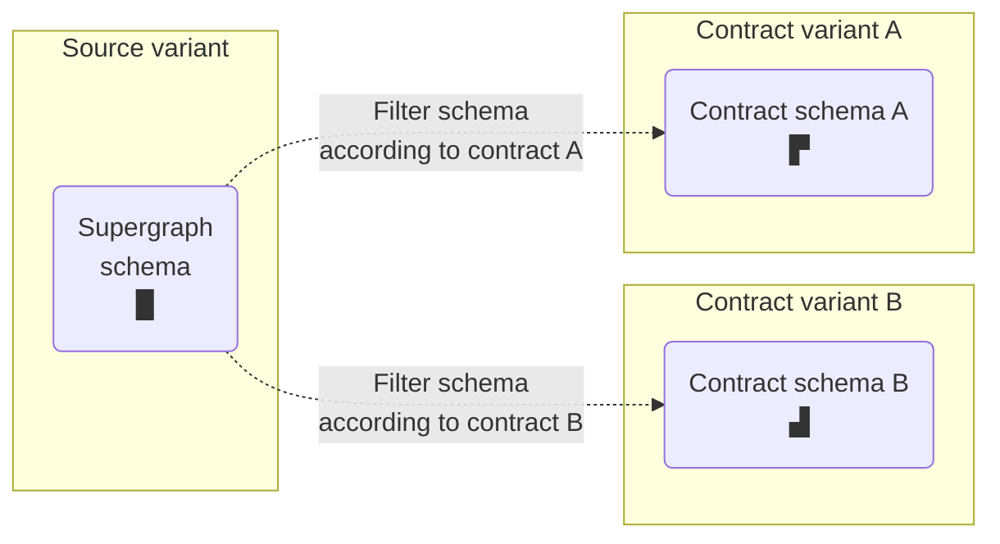

import AuthNotice from '../../shared/auth-notice.mdx';

GraphOS [contracts](/graphos/delivery/contracts/) enable you to create variants of a supergraph that filter out schema elements according to inclusion and exclusion rules:



The `rover contract` command set enables you to interact with your existing contracts and create new ones.

## Publishing a contract to GraphOS

### `contract publish`

<AuthNotice />

You can use Rover to publish a new contract or publish configuration changes to an existing contract.

Run the `contract publish` command, like so:

```bash
rover contract publish my-graph@my-contract-variant \
  --source-variant my-source-variant \
  --include-tag foo \
  --include-tag bar \
  --exclude-tag baz \
  --hide-unreachable-types
```

The argument `my-graph@my-contract-variant` in the example above is a [graph ref](../conventions/#graph-refs) that specifies the ID of the graph you're publishing to, along with which contract variant you're creating or modifying.

If this contract variant already exists in the graph registry, its configuration is updated. Otherwise, a new contract variant is created.

Options include:

<table class="field-table">
<thead>
<tr>
<th>Name</th>
<th>Description</th>
</tr>
</thead>
<tbody>
<tr class="required">
<td>

###### `--source-variant`

</td>
<td>

The name of the [source variant](/graphos/delivery/contracts/#2-fed1-enable-variant-support-for-tag) to use for supergraph schema filtering.

The source variant must belong to the same graph as the contract variant. It must also be a federated variant with subgraphs. If your graph uses Federation 1, you must enable its support for the `@tag` directive in GraphOS Studio.

**Required** the first time you publish a contract.

**Optional** after your first publish. If provided, it must match the value provided for the first publish (the source variant for a particular contract variant can't change).

</td>
</tr>
<tr class="required">
<td>

###### `--include-tag`

</td>
<td>

A tag name to [include](/graphos/delivery/contracts/#contract-filters) when filtering. To include multiple tag names, specify `--include-tag` multiple times:

```bash
--include-tag foo --include-tag bar
```

To specify an empty include list, provide`--no-include-tags` instead of this option.

Every tag name **must**:

* Begin with a letter (capital or lowercase) or underscore.
* Include only letters, numbers, underscores (`_`), hyphens (`-`), or slashes (`/`).
* Have a maximum of 128 characters.

One of `--include-tag` or `--no-include-tags` is **required**.

</td>
</tr>
<tr class="required">
<td>

###### `--no-include-tags`

</td>
<td>

Specifies an empty [include list](/graphos/delivery/contracts/#contract-filters) for the published contract.

One of `--include-tag` or `--no-include-tags` is **required**.

</td>
</tr>
<tr class="required">
<td>

###### `--exclude-tag`

</td>
<td>

A tag name to [exclude](/graphos/delivery/contracts/#contract-filters) when filtering. To exclude multiple tag names, specify `--exclude-tag` multiple times:

```
--exclude-tag foo --exclude-tag bar
```

To specify an empty exclude list, provide`--no-exclude-tags` instead of this option.

Every tag name **must**:

* Begin with a letter (capital or lowercase) or underscore.
* Include only letters, numbers, underscores (`_`), hyphens (`-`), or slashes (`/`).
* Have a maximum of 128 characters.

One of `--exclude-tag` or `--no-exclude-tags` is **required**.

</td>
</tr>
<tr class="required">
<td>

###### `--no-exclude-tags`

</td>
<td>

Specifies an empty [exclude list](/graphos/delivery/contracts/#contract-filters) for the published contract.

One of `--exclude-tag` or `--no-exclude-tags` is **required**.

</td>
</tr>
<tr class="required">
<td>

###### `--hide-unreachable-types`

</td>
<td>

If provided, the contract automatically [hides](/graphos/delivery/contracts/#contract-filters) types that are unreachable from the contract schema's root fields.

One of `--hide-unreachable-types` or `--no-hide-unreachable-types` is **required**.

</td>
</tr>
<tr class="required">
<td>

###### `--no-hide-unreachable-types`

</td>
<td>

If provided, the contract doesn't automatically hide types that are unreachable from the contract schema's root fields.

One of `--hide-unreachable-types` or `--no-hide-unreachable-types` is **required**.

</td>
</tr>
<tr>
<td>

###### `--no-launch`

</td>
<td>

**Optional.** If provided, this command does not trigger a [launch](/graphos/delivery/contracts/#review-and-launch) in GraphOS after updating the contract configuration.

</td>
</tr>
</tbody>
</table>

## Fetching contract details

### `contract describe`

<AuthNotice />

You can use Rover to fetch the configuration of any contract variant that Rover has access to.

Run the `contract describe` command, like so:

```bash
rover contract describe my-graph@my-contract-variant
```

The argument `my-graph@my-contract-variant` in the example above is a [graph ref](../conventions/#graph-refs) that specifies the ID of the GraphOS graph you're fetching from, along with which contract variant you're fetching.

This command prints a summary of the contract's configuration, including its source variant and include/exclude lists:

```
Fetching description for configuration of my-graph@my-contract-variant using credentials from the default profile.

Configuration Description:

Contract variant "my-graph@my-contract-variant" is derived from the source variant "my-graph@my-source-variant".

Included tags:

- "foo"
- "bar"

Excluded tags:

- "baz"

Unreachable types are automatically hidden.

View the variant's full configuration at https://studio.apollographql.com/graph/my-graph/settings/variant?variant=my-contract-variant
```
