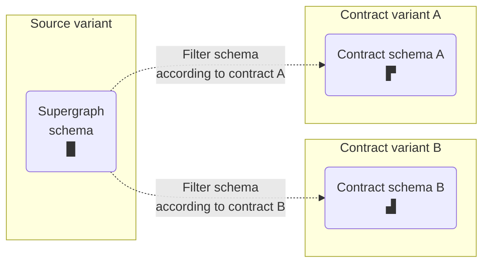

import AuthNotice from '../../shared/auth-notice.mdx';

GraphOS [contracts](/graphos/delivery/contracts/) enable you to create variants of a supergraph that filter out schema elements according to inclusion and exclusion rules:


```mermaid
graph LR;
  subgraph "Source variant";
  api("Supergraph<br/>schema<br/>▉");
  end
  subgraph "Contract variant B"
  contractB("Contract schema B<br/>▟")
  end
  subgraph "Contract variant A"
  contractA("Contract schema A<br/>▛");
  end
  api -."Filter schema<br/>according to contract A".->contractA
  api -."Filter schema<br/>according to contract B".->contractB
```

The `rover contract` command set enables you to interact with your existing contracts and create new ones.

## Publishing a contract to GraphOS

### `contract publish`

<AuthNotice />

You can use Rover to publish a new contract or publish configuration changes to an existing contract.

Run the `contract publish` command, like so:

```bash
rover contract publish my-graph@my-contract-variant \
  --source-variant my-source-variant \
  --include-tag foo \
  --include-tag bar \
  --exclude-tag baz \
  --hide-unreachable-types
```

The argument `my-graph@my-contract-variant` in the example above is a [graph ref](../conventions/#graph-refs) that specifies the ID of the graph you're publishing to, along with which contract variant you're creating or modifying.

If this contract variant already exists in the graph registry, its configuration is updated. Otherwise, a new contract variant is created.

Options include:

<table class="field-table">
<thead>
<tr>
<th>Name</th>
<th>Description</th>
</tr>
</thead>
<tbody>
<tr class="required">
<td>

###### `--source-variant`

</td>
<td>

The name of the [source variant](/graphos/delivery/contracts/#2-fed1-enable-variant-support-for-tag) to use for supergraph schema filtering.

The source variant must belong to the same graph as the contract variant. It must also be a federated variant with subgraphs. If your graph uses Federation 1, you must enable its support for the `@tag` directive in GraphOS Studio.

**Required** the first time you publish a contract.

**Optional** after your first publish. If provided, it must match the value provided for the first publish (the source variant for a particular contract variant can't change).

</td>
</tr>
<tr class="required">
<td>

###### `--include-tag`

</td>
<td>

A tag name to include when filtering. To include multiple tag names, specify `--include-tag` multiple times. For details, see the [contract filters documentation](https://www.apollographql.com/docs/graphos/delivery/contracts/#contract-filters).

```bash
--include-tag foo --include-tag bar
```

To specify an empty include list, provide`--no-include-tags` instead of this option.

Every tag name **must**:

* Begin with a letter (capital or lowercase) or underscore.
* Include only letters, numbers, underscores (`_`), hyphens (`-`), or slashes (`/`).
* Have a maximum of 128 characters.

Specify either `--include-tag` or `--no-include-tags`.

</td>
</tr>
<tr class="required">
<td>

###### `--no-include-tags`

</td>
<td>

Specifies an empty [include list](/graphos/delivery/contracts/#contract-filters) for the published contract.

Provide either `--include-tag` or `--no-include-tags`.

</td>
</tr>
<tr class="required">
<td>

###### `--exclude-tag`

</td>
<td>

Provide a tag name to exclude when filtering. To exclude multiple tag names, specify `--exclude-tag` multiple times. For details, see the [contract filters documentation](/graphos/delivery/contracts/#contract-filters).

```
--exclude-tag foo --exclude-tag bar
```

To specify an empty exclude list, provide`--no-exclude-tags` instead of this option.

Every tag name **must**:

* Begin with a letter (capital or lowercase) or underscore.
* Include only letters, numbers, underscores (`_`), hyphens (`-`), or slashes (`/`).
* Have a maximum of 128 characters.

Specify either `--exclude-tag` or `--no-exclude-tags`.

</td>
</tr>
<tr class="required">
<td>

###### `--no-exclude-tags`

</td>
<td>

Specifies an empty [exclude list](/graphos/delivery/contracts/#contract-filters) for the published contract.

Provide either `--exclude-tag` or `--no-exclude-tags`.

</td>
</tr>
<tr class="required">
<td>

###### `--hide-unreachable-types`

</td>
<td>

If provided, the contract automatically [hides](/graphos/delivery/contracts/#contract-filters) types that are unreachable from the contract schema's root fields.

Specify either `--hide-unreachable-types` or `--no-hide-unreachable-types`.

</td>
</tr>
<tr class="required">
<td>

###### `--no-hide-unreachable-types`

</td>
<td>

If provided, the contract doesn't automatically hide types that are unreachable from the contract schema's root fields.

Provide either `--hide-unreachable-types` or `--no-hide-unreachable-types`.

</td>
</tr>
<tr>
<td>

###### `--no-launch`

</td>
<td>

**Optional.** If provided, this command does not trigger a [launch](/graphos/delivery/contracts/#review-and-launch) in GraphOS after updating the contract configuration.

</td>
</tr>
</tbody>
</table>

## Preview a contract

### `contract preview`

<AuthNotice />

Before publishing a contract to GraphOS, preview the contract schema that a given filter produces, without publishing a contract variant.

Use the `contract preview` command to view the resulting schema:

```bash
rover contract preview my-graph@my-source-variant \
  --include-tag foo \
  --include-tag bar \
  --exclude-tag baz \
  --hide-unreachable-types
```

The argument `my-graph@my-source-variant` in the example above is a [graph ref](../conventions/#graph-refs) that specifies the ID of the graph and the [source variant](/graphos/delivery/contracts/#2-fed1-enable-variant-support-for-tag) whose already-composed supergraph schema you want to filter.

Preview builds run asynchronously on GraphOS. By default, Rover starts the build and polls its status until it completes, then prints the resulting schema. See [Running previews asynchronously](#running-previews-asynchronously) below to instead return immediately with a build ID and check the result later.

Options include:

<table class="field-table">
<thead>
<tr>
<th>Name</th>
<th>Description</th>
</tr>
</thead>
<tbody>
<tr class="required">
<td>

###### `--include-tag`

</td>
<td>

A tag name to include in [contract filters](/graphos/delivery/contracts/#contract-filters) when filtering. To include multiple tag names, specify `--include-tag` multiple times:

```bash
--include-tag foo --include-tag bar
```

To specify an empty include list, enable `--no-include-tags`.

One of `--include-tag` or `--no-include-tags` is required.

</td>
</tr>
<tr class="required">
<td>

###### `--no-include-tags`

</td>
<td>

Specifies an empty [include list](/graphos/delivery/contracts/#contract-filters) for the previewed contract.

One of `--include-tag` or `--no-include-tags` is **required**.

</td>
</tr>
<tr class="required">
<td>

###### `--exclude-tag`

</td>
<td>

A tag name to exclude when filtering. For details, see the [contract filters](/graphos/delivery/contracts/#contract-filters) documentation. To exclude multiple tag names, specify `--exclude-tag` multiple times:

```bash
--exclude-tag foo --exclude-tag bar
```

To specify an empty exclude list, enable `--no-exclude-tags`.

One of `--exclude-tag` or `--no-exclude-tags` is required.

</td>
</tr>
<tr class="required">
<td>

###### `--no-exclude-tags`

</td>
<td>

Use this to specify an empty [contract filter list](/graphos/delivery/contracts/#contract-filters) for the previewed contract.

One of `--exclude-tag` or `--no-exclude-tags` is **required**.

</td>
</tr>
<tr class="required">
<td>

###### `--hide-unreachable-types`

</td>
<td>

If provided, the preview automatically hides types that are unreachable from contract schema's root fields. For details, see [contract filters](/graphos/delivery/contracts/#contract-filters).

Provide either `--hide-unreachable-types` or `--no-hide-unreachable-types`.

</td>
</tr>
<tr class="required">
<td>

###### `--no-hide-unreachable-types`

</td>
<td>

If provided, the preview doesn't automatically hide types that are unreachable from the contract schema's root fields.

Provide either `--hide-unreachable-types` or `--no-hide-unreachable-types`.

</td>
</tr>
<tr>
<td>

###### `--async`

</td>
<td>

Optional. If provided, Rover starts the preview build and immediately returns with a build ID, instead of waiting for it to complete. Check the build's status later with `--build-id`.

</td>
</tr>
<tr>
<td>

###### `--build-id`

</td>
<td>

Optional. Check the status of a previously started preview build once, instead of starting a new one. You can't combine this with `--async` or the include/exclude/hide-unreachable-types options following.

</td>
</tr>
</tbody>
</table>

#### Running previews asynchronously

For long-running preview builds, use the `--async` flag to start the build and return a build ID immediately.

```bash
rover contract preview my-graph@my-source-variant \
  --include-tag foo --no-exclude-tags --hide-unreachable-types --async
```

Check the status of the build later with `--build-id`:

```bash
```bash
```bash
rover contract preview my-graph@my-source-variant --build-id <BUILD_ID>
```
```
```

By default (without `--async`), Rover CLI polls the build's status until it completes or [`APOLLO_CHECKS_TIMEOUT_SECONDS`](../configuring/#supported-environment-variables) elapses, whichever comes first. If Rover CLI times out while polling, the build itself may still complete in the background—check back with `--build-id`.

## Fetching contract details

### `contract describe`

<AuthNotice />

You can use Rover to fetch the configuration of any contract variant that Rover has access to.

Run the `contract describe` command, like so:

```bash
rover contract describe my-graph@my-contract-variant
```

The argument `my-graph@my-contract-variant` in the example above is a [graph ref](../conventions/#graph-refs) that specifies the ID of the GraphOS graph you're fetching from, along with which contract variant you're fetching.

This command prints a summary of the contract's configuration, including its source variant and include/exclude lists:

```
Fetching description for configuration of my-graph@my-contract-variant using credentials from the default profile.

Configuration Description:

Contract variant "my-graph@my-contract-variant" is derived from the source variant "my-graph@my-source-variant".

Included tags:

- "foo"
- "bar"

Excluded tags:

- "baz"

Unreachable types are automatically hidden.

View the variant's full configuration at https://studio.apollographql.com/graph/my-graph/settings/variant?variant=my-contract-variant
```
