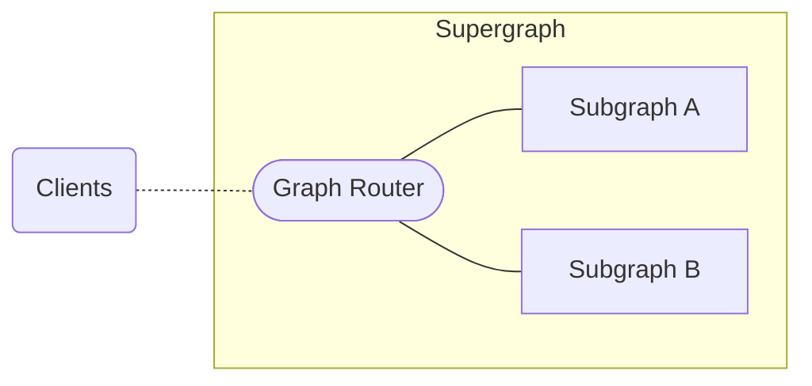

A _supergraph_ is an architecture consisting of multiple GraphQL APIs (_subgraphs_) and a _graph router_ that runs in front of them:



While you're making local changes to an individual subgraph, you can use the `rover dev` command to start a local router instance and test the effects of subgraph changes on your entire supergraph.

Whenever you add, modify, or remove a subgraph from your local supergraph, Rover automatically re-composes your individual subgraph schemas into a unified supergraph schema and provides it to your local router session.

<Caution>

Don't run `rover dev` in production. It's for local development only.

</Caution>

## Starting a router session

To use `rover dev`, you need at least one running GraphQL API (subgraph). Rover can obtain a subgraph's schema via introspection (either standard or [federated introspection](/federation/subgraph-spec#enhanced-introspection-with-query_service)), or you can provide a local schema file.

Here's an example `rover dev` command that points to a locally running subgraph and provides its schema via a local file:

```bash title="Example command" showLineNumbers=false
rover dev --name products --schema ./products.graphql --url http://localhost:4000
```

<Note>

You don't have to provide a locally running subgraph. You can point to any GraphQL endpoint that your local environment can reach. You can even mix and match local and remote subgraphs, which is helpful for testing local changes against your staging subgraphs.

</Note>

When you start your first `rover dev` process:

1. Rover obtains the subgraph schema(s) you provide via the [supergraph config file](./supergraphs#yaml-configuration-file).
2. Rover composes a [supergraph schema](/federation/federated-types/overview/#supergraph-schema) from the subgraph schema(s).
3. Rover starts a locally running [router](/router) session and provides it the supergraph schema.
4. Rover starts watching the provided subgraph schema(s) for changes, recomposing the supergraph schema whenever it detects a change. This automatically reloads the router.
5. When provided via the `--router-config` CLI option, Rover starts watching the router config for changes, automatically reloading the router whenever it detects a change.

### Starting a session with multiple subgraphs

If you work with a standard set of subgraphs, you can create a [supergraph config file](./supergraphs#yaml-configuration-file) and add all of them to your local router session with a single `rover dev` command.

For example, this `supergraph.yaml` file provides the necessary details for two subgraphs:

```yaml title="supergraph.yaml" showLineNumbers=false
federation_version: =2.4.7
subgraphs:
  products:
    routing_url: http://localhost:4000
    schema:
      file: ./products.graphql # Schema provided via file
  reviews:
    schema:
      subgraph_url: http://localhost:4001 # Schema provided via introspection, routing_url can be omitted
  users:
    # routing_url: <Optional, pulled from GraphOS registry by default>
    schema:  # Schema downloaded from GraphOS registry, does not poll for updates
      graphref: mygraph@current
      subgraph: actors
```

You provide this file to `rover dev` like so:

```bash showLineNumbers=false
rover dev --supergraph-config supergraph.yaml
```

If you do, a router session starts with one of the subgraphs listed, then adds the remaining subgraphs one at a time (order is undefined). Because of this, you might observe composition errors during intermediate steps.

Providing a `supergraph.yaml` file also enables you to take advantage of [other config options](./supergraphs#yaml-configuration-file), such as `introspection_headers`.

Rover watches the [supergraph config file](./supergraphs#yaml-configuration-file) for changes, allowing you to add, remove, or update subgraphs, making those changes available to the router instance. Only one config file may be used at a time for the `rover dev` session.

### Starting a session from a GraphOS Studio variant

<Note>

Apollo is actively improving the integration between Rover and GraphOS Studio.
If you have feedback on this functionality, please [get in touch](mailto:cloud@apollographql.com).

</Note>

To start a local router instance using a GraphOS Studio variant, include the variant's graph ref with the `--graph-ref` option like so:

```bash showLineNumbers=false
rover dev --graph-ref docs-example-graph@current
```

<Note>

To pass a graph ref, you need a personal API key or graph API key configured in Rover.

</Note>

When you include a graph ref, Rover uses the associated variant's subgraph routing URLs and schemas from Studio as the supergraph config.
You can view a variant's subgraphs, including their routing URLs and schemas, on the variant's **Subgraphs** page in Studio.
You may also use remote subgraphs in your [supergraph config file](./supergraphs#yaml-configuration-file). See the `actors` subgraph in the `supergraph.yaml` example above for the syntax.

#### Overriding variant subgraphs

While developing locally, you may want to override one or more subgraph(s) in your Studio variant with subgraphs from your local environment.
You can do this by passing a [supergraph config file](./supergraphs#yaml-configuration-file) alongside a graph ref. Any subgraphs defined in the supergraph config file override those from the graph ref.

For example, given a `supergraph_override.yaml` file like this:

```yaml title="supergraph_override.yaml" showLineNumbers=false
subgraphs:
  products:
    routing_url: http://localhost:4000
    schema:
      file: ./products.graphql
```

You can override a variant's published `products` subgraph like so:

```bash showLineNumbers=false
rover dev \
  --graph-ref docs-example-graph@current \
  --supergraph-config path/to/supergraph_override.yaml

```

This command overrides the variant's published `products` subgraph in your local development session.
If the Studio variant doesn't include a `products` subgraph, this command adds the subgraph and recomposes the supergraph schema.
 
#### Overriding federation versions

You can also use a [supergraph config file](./supergraphs#yaml-configuration-file) to safely test a new federation version locally before putting it in production.

For example, given a `federation_override.yaml` file like this:

```yaml title="federation_override.yaml" showLineNumbers=false
federation_version: =2.4.7
```

You can override a variant's federation version like so:

```bash showLineNumbers=false
rover dev \
  --graph-ref docs-example-graph@current \
  --supergraph-config federation_override.yaml
```

Or by passing the `--federation-version` option.

```bash showLineNumbers=false
rover dev \
  --graph-ref docs-example-graph@current \
  --supergraph-config federation_override.yaml
  --federation-version '=2.9.3'
```

If both are provided, the CLI option takes precedence. This argument accepts [federation versions](/graphos/reference/router/federation-version-support) in their exact form using a preceding equal sign, such as '=2.9.3'. For latest versions of Federation 1 or 2, it accepts '1' or '2'.

## Adding, removing, or updating subgraphs in a `rover dev` session

While running `rover dev`, it's possible to add, remove, and update subgraphs by updating the [supergraph config file](./supergraphs#yaml-configuration-file).

## Health check

By default, the router's health check endpoint is disabled in `rover dev`. You can enable it again by enabling it in a router configuration YAML file and passing it to `rover dev` via the `--router-config` argument described in the following section.

## Configuring the router

To configure advanced router functionality like CORS settings or header passthrough for subgraphs, you can pass a valid [router configuration YAML file](/router/configuration/overview#yaml-config-file) to `rover dev` via the `--router-config <ROUTER_CONFIG_PATH>` argument.

### Enterprise features

If you want to use [enterprise router features](/router/enterprise-features/), you must provide both:

1. A graph ref via the `APOLLO_GRAPH_REF` environment variable or the `--graph-ref` option.
2. A [**graph** API key](/graphos/api-keys/#graph-api-keys) either via the `APOLLO_KEY` environment or by [configuring credentials](./config#creating-configuration-profiles) in Rover.

## Federation 2 ELv2 license

The first time you use Federation 2 composition on a particular machine, Rover prompts you to accept the terms and conditions of the [ELv2 license](/resources/elastic-license-v2-faq/). On future invocations, Rover remembers that you already accepted the license and doesn't prompt you again (even if you update Rover).

## Plugins

The ELv2-licensed plugins, `supergraph` (built from [this source](https://github.com/apollographql/federation-rs)) and `router` (built from [this source](https://github.com/apollographql/router)) are installed to `~/.rover/bin` if you installed with the `curl | sh` installer, and to `./node_modules/.bin/` if you installed with npm.

## Versioning

By default, `rover dev` uses the latest version of the router and composition plugins. The latest version for each is currently configured in the Rover GitHub repo, however, you can override either of these by setting the environment variables `APOLLO_ROVER_DEV_COMPOSITION_VERSION=2.0.0` and `APOLLO_ROVER_DEV_ROUTER_VERSION=1.0.0`. If you already have these plugins installed, you can pass `--skip-update` to `rover dev` in order to keep the plugins at the same version.
