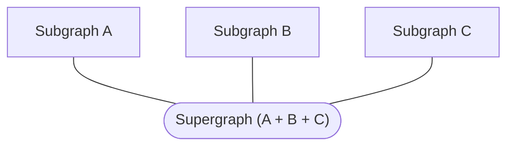

You can use Rover to start a local router that can query across one or more running GraphQL APIs (i.e., subgraphs)
through one endpoint (i.e., supergraph). As you add, edit, and remove subgraphs, Rover automatically
composes their separate schemas into a unified supergraph schema that the router reloads and serves. 

Think plug-n-play USB devices but with your GraphQL APIs!

A **subgraph** is a graph that contributes to the composition of a federated **supergraph**:

> ⚠️ Do not run this command in production! ⚠️ This command is only intended for local development.

## Creating a federated session

### Starting the session

Before starting `rover dev`, you need to start your GraphQL API (subgraph). Note the URL it is running on, and the location of the schema on the filesystem if it exists. If you don't have a local schema file, introspection will need to be enabled on the subgraph.

An example `rover dev` command for running a local subgraph might look something like this:

`rover dev --name products --schema ./products.graphql --url http://localhost:4000`

The above command starts the `rover dev` session, watching `./products.graphql` for changes to the schema, and starts up a local Apollo Router at the default endpoint (i.e., `http://localhost:3000`). This session also listens for other `rover dev` processes that include different subgraph schemas.

### Stopping the session

If you stop the first `rover dev` session (by pressing ctrl+c), it will shut down the router and any attached `rover dev` sessions will be detached and shut down.

### Attaching additional subgraphs to a session

To add a new subgraph to a session, run `rover dev` in a new terminal with the necessary arguments for your GraphQL API (i.e., subgraph). If a session is already running, Rover automatically attaches subsequent `rover dev` processes to that existing session.

When you add a new subgraph to a session, Rover handles recomposing the supergraph schema and printing the build result in the outputs of both the main session and the attached session.

### Triggering recomposition on subgraph changes

Each `rover dev` process is responsible for monitoring its subgraph schema.

#### Via filesystem update _(recommended)_

If you pass the `--schema <PATH>` argument, `rover dev` will watch the schema file for changes and report any updates to the main `rover dev` session if a schema's contents change.

#### Via introspection _(not recommended)_

If you don't pass the `--schema <PATH>` argument, `rover dev` will introspect the URL that was specified by the `--url <SUBGRAPH_URL>` argument once every second. The command prefers to use the same query as `rover subgraph introspect`, but it will fall back to `rover graph introspect` if your GraphQL API does not support introspecting federated SDL. If this is the case, directives are stripped from the subgraph schema.

### Stopping an attached process

If you stop an attached `rover dev` process (using `ctrl+c`), the supergraph will de-compose the removed subgraph and reload the router.

### Federation 2 ELv2 license

The first time you use Federation 2 composition on a particular machine, Rover prompts you to accept the terms and conditions of the [ELv2 license](https://www.apollographql.com/docs/resources/elastic-license-v2-faq/). On future invocations, Rover remembers that you already accepted the license and doesn't prompt you again (even if you update Rover).

The ELv2-licensed plugins, `supergraph` (built from [this source](https://github.com/apollographql/federation-rs)) and `router` (built from [this source](https://github.com/apollographql/router)) are installed to `~/.rover/bin` if you installed with the `curl | sh` installer, and to `./node_modules/.bin/` if you installed with npm.
