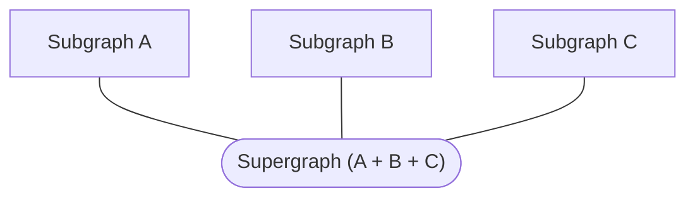

A **supergraph** (also called a federated graph) is a graph composed of multiple **subgraphs**:



Rover new commands help you create new subgraphs from templated projects in various [Federation-compatible implementaitons](/federation/supported-subgraphs).

This feature is intended to help quickly start up a new GraphQL project and enable new developers to explore various implementations. If you have an idea or want to contribute a specific template, open an issue here!

## Using the wizard to create a new subgraph project

### `new {PATH}`

You can use `rover new` to initialize the wizard. This requires entering the PATH you would like the project created.

```bash
rover new .
```

> You will be prompted through a series of questions to filter down to the exact template you want to use.

The `PATH` arguement is the relative path to create the project directory in.

### Project Languages

You can also pass a specific project language you want to build your subgraph in and `rover new` will only show the templates available in that language

```shell
rover new . --language=python
```

### Project types

You can also provide whether you're building a client or subgraph project to filter templates directly to those types.

```shell
rover new . --project-type=subgraph
```
