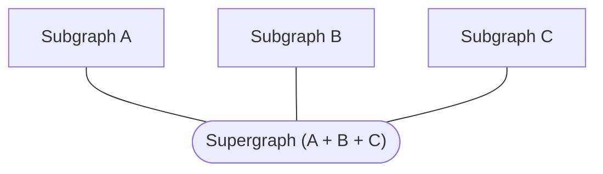

import AuthNotice from "../../shared/auth-notice.mdx";

A _subgraph_ is a graph that contributes to the composition of a federated _supergraph_:



Rover commands that interact with subgraphs begin with `rover subgraph`.

## Fetching a subgraph schema

These commands enable you to fetch the schema for a single subgraph in a supergraph. To instead fetch the API schema for a supergraph, use [`rover graph fetch`](./graphs#graph-fetch). To fetch the supergraph schema, use [`rover supergraph fetch`](./supergraphs#supergraph-fetch).

### `subgraph fetch`

<AuthNotice />

You can use Rover to fetch the current schema of any subgraph that belongs to a graph variant or schema proposal that Rover has access to.

Run the `subgraph fetch` command, like so:

```bash
rover subgraph fetch my-graph@my-variant --name accounts
```

The argument `my-graph@my-variant` in the example above is a [graph ref](../conventions/#graph-refs) that specifies the ID of the Studio graph you're fetching from, along with which [variant](/graphos/graphs/#variants) you're fetching.

The `--name` option is required.** It specifies which subgraph you're fetching the schema for.

#### Fetch subgraph schemas from proposals

To fetch a subgraph schema from a schema proposal, use the proposal's ID instead of a variant name like so:

```bash
rover subgraph fetch my-graph@p-101 --name accounts
```

A proposal's ID is always prefixed with `p-` and followed by a number. You can find the proposal ID in the proposal's URL in [GraphOS Studio](https://studio.apollographql.com?referrer=docs-content). For example, a proposal with the following URL has an ID of `p-101`.

`https://studio.apollographql.com/graph/Example-supergraph/proposal/p-101/home`

<Note>

Though you can use `rover subgraph fetch` to pull subgraph schemas from proposals, you can't currently use [`rover subgraph publish`](#subgraph-publish) to push schema changes to a proposal.
If you use `rover subgraph publish` with a proposal ID, the change is pushed to the proposal's underlying variant, but not the proposal itself. Use the [proposal editor](/graphos/delivery/schema-proposals/creation/#edit-subgraph-schemas) in GraphOS Studio instead.

</Note>

### `subgraph introspect`

If you need to obtain a running subgraph's schema, you can use Rover to execute an enhanced introspection query on it. This is especially helpful if the subgraph doesn't define its schema via SDL (as is the case with [`graphql-kotlin`](https://github.com/ExpediaGroup/graphql-kotlin)).

Use the `subgraph introspect` command, like so:

```bash
rover subgraph introspect http://localhost:4001
```

The subgraph must be reachable by Rover. The subgraph does not need to have introspection enabled.

Unlike a standard introspection query, the result of `rover subgraph introspect` does include certain directives (specifically, directives related to federation like `@key`). This is possible because the command uses a separate introspection mechanism provided by the [Apollo Federation subgraph specification](/federation/subgraph-spec/#enhanced-introspection-with-query_service).

#### Watching for schema changes

If you pass `--watch` to `rover subgraph introspect`, Rover introspects your subgraph every second. Whenever the returned schema differs from the previously returned schema, Rover outputs the updated schema. This is most useful when combined with the `--output <OUTPUT_FILE>` argument which will write the introspection response out to a file whenever its contents change.

#### Including headers

If the endpoint you're trying to reach requires HTTP headers, you can use the `--header` (`-H`) flag to pass `key:value` pairs of headers. If you have multiple headers to pass, provide the flag multiple times. If a header includes any spaces, the pair must be quoted.

```shell
rover subgraph introspect http://localhost:4001 --header "Authorization: Bearer token329r"
```

### Output format

```sh
rover subgraph introspect http://localhost:4001\
  | rover subgraph publish my-graph@dev\
  --schema - --name accounts\
  --routing-url https://my-running-subgraph.com/api
```

By default, both `subgraph fetch` and `subgraph introspect` output fetched SDL to `stdout`. This is useful for providing the schema as input to other Rover commands:

```shell
rover subgraph introspect http://localhost:4000 | rover subgraph check my-graph --schema -
```

You can also save the output to a local `.graphql` file like so:

```bash
# Creates accounts-schema.graphql or overwrites if it already exists
rover subgraph introspect http://localhost:4000 --output accounts-schema.graphql
```

For more on passing values via `stdout`, see [Using `stdout`](../conventions#using-stdout).

## Listing subgraphs in a supergraph

### `subgraph list`

<AuthNotice />

You can use the `subgraph list` to list all of a particular supergraph's available subgraphs in GraphOS:

```bash
rover subgraph list my-supergraph@staging
```

This command lists all subgraphs for the specified variant, including their routing URLs and when they were last updated (in local time). A link to view this information in GraphOS Studio is also provided.

```
Subgraphs:

+----------+-------------- --------------+----------------------------+
| Name     | Routing Url                 | Last Updated               |
+----------+-----------------------------+----------------------------+
| reviews  | https://reviews.my-app.com  | 2020-10-21 12:23:28 -04:00 |
+----------+----------------------------------------+-----------------+
| books    | https://books.my-app.com    | 2020-09-20 13:58:27 -04:00 |
+----------+----------------------------------------+-----------------+
| accounts | https://accounts.my-app.com | 2020-09-20 12:23:36 -04:00 |
+----------+----------------------------------------+-----------------+
| products | https://products.my-app.com | 2020-09-20 12:23:28 -04:00 |
+----------+----------------------------------------+-----------------+

View full details at https://studio.apollographql.com/graph/my-supergraph/service-list
```

## Publishing a subgraph schema to GraphOS

### `subgraph publish`

<Note>
See also the guide for [Using Subgraph Keys in a Deployment Pipeline](/graphos/resources/guides/getting-started-with-pipelines-and-keys).
</Note>

<AuthNotice />

You can use Rover to publish schema changes to a subgraph that belongs to a supergraph variant or schema proposal that Rover has access to.

Use the `subgraph publish` command, like so:

```bash
rover subgraph publish my-supergraph@my-variant \
  --schema "./accounts/schema.graphql" \
  --name accounts \
  --routing-url "https://my-running-subgraph.com/api"
```

The argument `my-supergraph@my-variant` in the example above is a [graph ref](../conventions/#graph-refs) that specifies the ID of the GraphOS graph you're publishing to, along with which [variant](/graphos/graphs/#variants) you're publishing to.

<Note>

- You can omit `@` and the variant name. If you do, Rover publishes the schema to the default variant, named `current`.
- You can't currently use `rover subgraph publish` to push schema changes to a proposal. If you use `rover subgraph publish` with a proposal ID, the change is pushed to the proposal's underlying variant, but not the proposal itself. Use the [proposal editor](/graphos/delivery/schema-proposals/creation/#edit-subgraph-schemas) in GraphOS Studio instead.

</Note>

Options include:

<table class="field-table">
<thead>
<tr>
<th>Name</th>
<th>Description</th>
</tr>
</thead>
<tbody>
<tr class="required">
<td>

###### `--schema`

</td>
<td>

**Required.** The path to a local `.graphql` or `.gql` file, in SDL format.

Alternatively, you can provide `-`, in which case the command uses an SDL string piped to `stdin` instead (see [Using `stdin`](../conventions#using-stdin)).

</td>
</tr>

<tr class="required">
<td>

###### `--name`

</td>

<td>

**Required.** The name of the subgraph to publish to.

Every subgraph name **must**:

- Begin with a letter (capital or lowercase)
- Include only letters, numbers, underscores (`_`), and hyphens (`-`)
- Have a maximum of 64 characters

</td>
</tr>

<tr class="required">
<td>

###### `--routing-url`

</td>

<td>

The URL that your supergraph uses to communicate with the subgraph in a [managed federation architecture](/federation/managed-federation/overview/).

**Required** the first time you publish a particular subgraph. If your subgraph isn't deployed yet, or if you aren't using managed federation, you can pass an empty string. Passing an empty string requires you to set the `--allow-invalid-routing-url` flag.

**Optional** after your first publish. Provide only if you need to change the subgraph's routing URL.

</td>
</tr>
<tr>
<td>

###### `--convert`

</td>

<td>

If a monolithic schema for this variant already exists in the graph registry instead of multiple subgraph schemas, you need to run `rover subgraph publish` with the `--convert` flag to convert this variant to a federated graph with one or more subgraphs.

This permanently deletes the monolithic schema from this variant and replaces it with a single subgraph. In many cases, you need to run `subgraph publish` for multiple or all of your subgraphs before Studio can successfully compose a supergraph schema.

This option has no effect if you publish to a non-monolithic variant.

</td>
</tr>
<tr>
<td>

###### `--allow-invalid-routing-url`

</td>

<td>

By default, `rover subgraph publish` will fail if an unparsable routing URL is associated with a subgraph. If you need to disable this warning and allow the invalid URL to be published anyway, you can pass this option.

</td>
</tr>
<tr>
<td>

###### `--no-url`

</td>

<td>

This is shorthand for `--routing-url "" --allow-invalid-routing-url`. **It will override any existing routing URL for the subgraph.**

</td>
</tr>
</tbody>
</table>

#### Creating variants

You can use the `subgraph publish` command to create a new variant, but not a new graph.

- If the graph exists in the graph registry but the variant does not, a new variant is created on publish.
- If the graph doesn't exist, the command fails.

## Validating subgraph schema changes

### `subgraph check`

<AuthNotice />

Before you [publish subgraph schema changes to GraphOS](#publishing-a-subgraph-schema-to-graphos), you can [check those changes](/graphos/delivery/schema-checks/) to confirm that you aren't introducing breaking changes to your application clients.

To do so, you can run the `subgraph check` command:

```shell
# using a schema file
rover subgraph check my-graph@my-variant --schema ./schema.graphql --name accounts

# using piped input to stdin
rover subgraph introspect http://localhost:4000 \
  | rover subgraph check my-graph@my-variant \
  --schema - --name accounts
```

As shown, arguments and options are similar to [`subgraph publish`](#subgraph-publish).

To configure the behavior of schema checks (such as the time range of past operations to check against), see the [documentation for schema checks](/graphos/delivery/check-configurations/#using-apollo-studio-recommended).

If you don't want to wait for the check to complete, you can run the command with the `--background` flag. You can then look up the check's result in GraphOS Studio on the Checks tab.

#### Running checks in CI

If you're running schema checks in CI, you might want to pass the `--background` flag to `rover subgraph check`. This flag instructs Rover to initiate schema checks but not await their result. If you've [connected GraphOS Studio to your GitHub repository](/graphos/delivery/github-integration/), the integration detects the checks execution and adds a status to the associated pull request.

### `subgraph lint`

<AuthNotice />

You can run the GraphOS schema linter against your local subgraph schema to identify any violations of formatting and naming best practices:

```bash title="Example command"
rover subgraph lint --name products --schema ./products-schema.graphql my-graph@my-variant
```

The argument `my-graph@my-variant` in the example above is a **graph ref** that specifies the ID of the graph you're comparing your schema changes against, along with which [variant](/graphos/graphs/#variants) you're comparing against.

Schema linting also runs as one of the checks included in [`subgraph check`](#subgraph-check). Use this command to perform one-off linting.

Options include:

<table class="field-table">
<thead>
<tr>
<th>Name</th>
<th>Description</th>
</tr>
</thead>
<tbody>
<tr class="required">
<td>

###### `--schema`

</td>
<td>

**Required.** The path to a local `.graphql` or `.gql` file, in SDL format.

Alternatively, you can provide `-`, in which case the command uses an SDL string piped to `stdin` instead (see [Using `stdin`](../conventions#using-stdin)).

</td>
</tr>

<tr class="required">
<td>

###### `--name`

</td>

<td>

**Required.** The name of the published subgraph to compare schema changes against.

</td>
</tr>

<tr>
<td>

###### `--ignore-existing-lint-violations`

</td>

<td>

If provided, the linter only flags violations that are present in the diff between your local schema and your published schema.

By default, this command flags all violations in your local schema.

</td>
</tr>

</tbody>
</table>

## Deleting a subgraph

### `subgraph delete`

<AuthNotice />

You can delete a single subgraph from a federated variant by running `rover subgraph delete`:

```bash
# ⚠️ This action is irreversible!
rover subgraph delete my-graph@my-variant --name subgraph-to-delete
```

This command prompts you for confirmation because the action is irreversible. You can bypass confirmation by passing the `--confirm` flag.

This command fails with an error if any other subgraph references types that originate in this subgraph.

To delete an entire federated graph instead of a single subgraph, see [Deleting a variant](./graphs/#deleting-a-variant).
