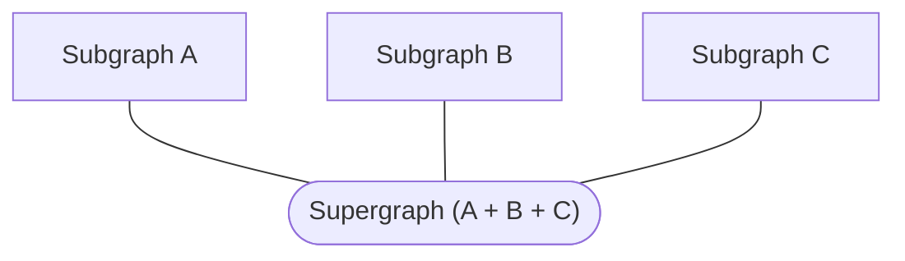
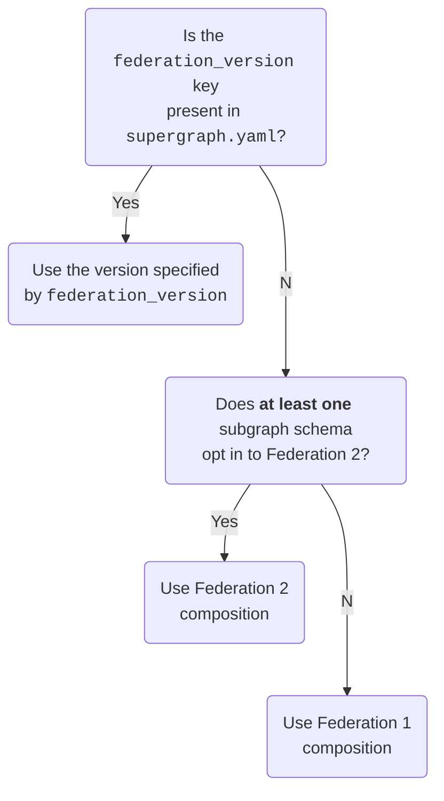

A **supergraph** (also called a federated graph) is a graph composed of multiple **subgraphs**:



Rover commands that interact with supergraphs begin with `rover supergraph`. These commands primarily deal with [supergraph schemas](/federation/federated-types/overview/).

## Fetching a supergraph schema from Apollo Studio

### `supergraph fetch`

> This command requires [authenticating Rover with Apollo Studio](../configuring/#authenticating-with-apollo-studio).

You can use Rover to fetch the supergraph schema of any federated Studio graph variant it has access to. Run the `supergraph fetch` command, like so:

```bash
rover supergraph fetch my-supergraph@my-variant
```

> To fetch a supergraph's API schema instead, use [`graph fetch`](./graphs/#fetching-a-schema). [Learn about different schema types.](/federation/federated-types/overview/)

The argument `my-supergraph@my-variant` in the example above specifies the ID of the Studio graph you're fetching from, along with which [variant](/graphos/graphs/overview/#variants) you're fetching.

> You can omit `@` and the variant name. If you do, Rover uses the default variant, named `current`.


## Composing a supergraph schema

### `supergraph compose`

You can use the `supergraph compose` command to [compose](/federation/federated-types/composition/) a supergraph schema based on a [supergraph configuration file](#yaml-configuration-file), like so:

```bash
rover supergraph compose --config ./supergraph.yaml
```

You can also pass config via stdin:

```bash
cat ./supergraph.yaml | rover supergraph compose --config -
```

### YAML configuration file

The supergraph configuration file (often referred to as `supergraph.yaml`) includes configuration options for each of your [subgraphs](/federation/building-supergraphs/subgraphs-overview/). The following example file configures a supergraph with two subgraphs (`films` and `people`):

```yaml title="supergraph.yaml"
federation_version: 2
subgraphs:
  films:
    routing_url: https://films.example.com
    schema:
      file: ./films.graphql
  people:
    routing_url: https://people.example.com
    schema:
      file: ./people.graphql
```

In the above example, The YAML file specifies each subgraph's public-facing URL (`routing_url`), along with the path to its schema (`schema.file`).

A single configuration file can pull subgraph schemas from a variety of sources. For example, here's a configuration that includes subgraph schemas from three different types of sources:

```yaml title="supergraph.yaml"
federation_version: 2
subgraphs:

  # Local .graphql file
  films:
    routing_url: https://films.example.com
    schema:
      file: ./films.graphql

  # Subgraph introspection
  people:
    routing_url: https://example.com/people
    schema:
      subgraph_url: https://example.com/people

  # Apollo Studio graph ref
  actors:
    routing_url: https://localhost:4005
    schema:
      graphref: mygraph@current
      subgraph: actors
```
### Output format

By default, `rover supergraph compose` outputs a [supergraph schema](/federation/federated-types/overview/) document to `stdout`. You provide this artifact to [`@apollo/gateway`](/federation/api/apollo-gateway/) or the [🦀 Apollo Router](/router/) on startup.

> ⚠️ **Your router/gateway fails to start up if you provide it with a supergraph schema that it doesn't support!** To ensure compatibility, we recommend that you always test launching your router/gateway in a CI pipeline with the supergraph schema it will ultimately use in production.

You can save the schema output to a local `.graphql` file like so:

```bash
# Creates prod-schema.graphql or overwrites if it already exists
rover supergraph compose --config ./supergraph.yaml > prod-schema.graphql
```

> For more on passing values via `stdout`, see [Using `stdout`](../conventions#using-stdout).

### Federation 2 ELv2 license

The first time you use Federation 2 composition on a particular machine, Rover prompts you to accept the terms and conditions of the [ELv2 license](https://www.apollographql.com/docs/resources/elastic-license-v2-faq/). On future invocations, Rover remembers that you already accepted the license and doesn't prompt you again (even if you update Rover).

> ⚠️ **Important:** CI systems wipe away any persisted Rover configuration on each run, and they can't accept the interactive ELv2 prompt. To automatically accept the prompt in CI, do any of the following:
>
> * Set the environment variable `APOLLO_ELV2_LICENSE=accept` in your CI environment.
> * Include `--elv2-license accept` in your `rover supergraph compose` command.
> * Run `yes | rover supergraph compose`

The ELv2-licensed `supergraph` plugin (built from [this source](https://github.com/apollographql/federation-rs)) is installed to `~/.rover/bin` if you installed with the `curl | sh` installer, and to `./node_modules/.bin/` if you installed with npm.

### Setting a composition version

The `supergraph compose` command supports both Federation 2 and Federation 1 composition. It determines which version to use according to the following logic:



> A subgraph schema "opts in" to Federation 2 by adding a special `@link` directive described in [this article](/federation/federation-2/moving-to-federation-2#opt-in-to-federation-2).

Here's an example `supergraph.yaml` file that specifies Federation 1 composition:

```yaml {1}
federation_version: 1
subgraphs:
  films:
    routing_url: https://films.example.com
    schema:
      file: ./films.graphql
```

> ⚠️ Note that if you use Federation 1 composition and _any_ of your subgraphs uses a Federation 2 schema, composition will fail!

### Updating composition libraries

Federation 1 and Federation 2 use different composition algorithms, which are implemented in different libraries:

* **Federation 1:** [`@apollo/federation`](https://www.npmjs.com/package/@apollo/federation)
* **Federation 2:** [`@apollo/composition`](https://www.npmjs.com/package/@apollo/composition)

Whenever you run `rover supergraph compose`, Rover automatically downloads the latest version of the library for your selected composition version (if there's an update).

Any updates to a given composition version should always be backward compatible. If composition unexpectedly breaks following an update, please [submit an issue](https://github.com/apollographql/federation/issues/new?assignees=&labels=&template=bug.md) and see [Pinning composition to a library version](#pinning-composition-to-a-library-version).

#### Preventing updates

In some cases, you might want Rover to skip updating its composition library to the latest version. For example, you might have a slow or nonexistent network connection.

In these cases, you can pass the `--skip-update` flag to `rover supergraph compose`. If you provide this flag, your `supergraph.yaml` file _must_ specify a `federation_version`.

#### Pinning composition to a library version

> ⚠️ You should do this _only_ if composition unexpectedly breaks between calls to `rover supergraph compose` as an attempt to debug the issue.

You can pin your composition algorithm to a particular version of its library via the `federation_version` key in your `supergraph.yaml` file:

```yaml title="supergraph.yaml"
federation_version: =2.0.1
```

In the above example, Rover uses _exactly_ version `2.0.1` of the `@apollo/composition` library for Federation 2 composition.

### Legacy Rover versions

Versions of Rover prior to v0.5.0 support _only_ Federation 1 composition, via the [`@apollo/federation`](https://www.npmjs.com/package/@apollo/federation) JavaScript package.

We recommend updating to the latest version of Rover as soon as possible. If you're still using a legacy version, see the following compatibility table regarding support for different versions of the `@apollo/gateway` library:

|Rover version|Gateway version|
|---|---|
|<= v0.2.x|<= v0.38.x|
|>= v0.3.x|>= v0.39.x|
