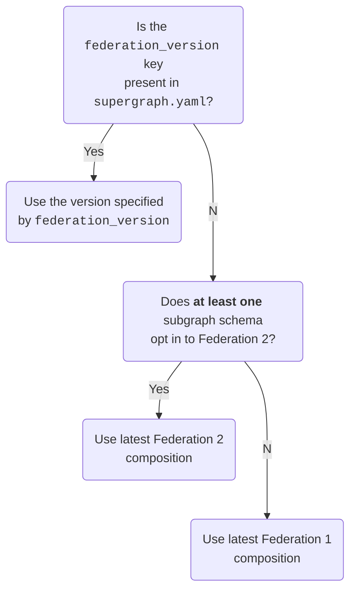

import AuthNotice from '../../shared/auth-notice.mdx';

A supergraph is a graph composed of multiple subgraphs:


Rover commands that interact with supergraphs begin with `rover supergraph`. These commands primarily deal with [supergraph schemas](/federation/federated-schemas).

## Fetching a supergraph schema from GraphOS

### `supergraph fetch`

<AuthNotice />

You can use Rover to fetch the supergraph schema of any federated GraphOS Studio variant it has access to. Run the `supergraph fetch` command, like so:

```bash
rover supergraph fetch my-supergraph@my-variant
```

To fetch a supergraph's API schema instead, use [`graph fetch`](./graphs/#fetching-a-schema). [Learn about different schema types.](/federation/federated-schemas)

The argument `my-supergraph@my-variant` in the example above specifies the ID of the Studio graph you're fetching from, along with which [variant](/graphos/graphs/#variants) you're fetching.

<Note>

You can omit `@` and the variant name. If you do, Rover uses the default variant, named `current`.

</Note>

## Composing a supergraph schema

### `supergraph compose`

You can use the `supergraph compose` command to [compose](/federation/federated-types/composition/) a supergraph schema based on a [supergraph configuration file](#yaml-configuration-file), like so:

```bash
rover supergraph compose --config ./supergraph.yaml
```

You can also pass config via stdin:

```bash
cat ./supergraph.yaml | rover supergraph compose --config -
```

### From a Studio variant

You can optionally pass a variant's graph ref to download each subgraph's SDL and compose the supergraph SDL like so:

```bash
rover supergraph compose --graph-ref platform@staging
```

You can optionally pass a [YAML configuration file](#yaml-configuration-file) to override specific subgraphs or add a new one.
This is useful for testing new subgraph schemas before publishing them.

For example, given a `supergraph_override.yaml` file like this:

```yaml title="supergraph_override.yaml" showLineNumbers=false
subgraphs:
  products:
    routing_url: http://localhost:4000
    schema:
      file: ./products.graphql
```

You can override a variant's published `products` subgraph like so:

```bash showLineNumbers=false
rover supergraph compose \
  --graph-ref docs-example-graph@current \
  --config path/to/supergraph_override.yaml

```

Note that you only need to set `routing_url` if you want to change it from the routing URL registered for the subgraph in GraphOS.

### YAML configuration file

The supergraph configuration file (often referred to as `supergraph.yaml`) includes configuration options for each of your [subgraphs](/federation/building-supergraphs/subgraphs-overview/). The following example file configures a supergraph with two subgraphs (`films` and `people`):

```yaml title="supergraph.yaml"
federation_version: =2.3.2
subgraphs:
  films:
    routing_url: https://films.example.com
    schema:
      file: ./films.graphql
  people:
    routing_url: https://people.example.com
    schema:
      file: ./people.graphql
```

In the above example, The YAML file specifies each subgraph's public-facing URL (`routing_url`), along with the path to its schema (`schema.file`).

A single configuration file can pull subgraph schemas from a variety of sources. For example, here's a configuration that includes subgraph schemas from three different types of sources:

```yaml title="supergraph.yaml"
federation_version: =2.3.2
subgraphs:

  # Local .graphql file
  films:
    routing_url: https://films.example.com
    schema:
      file: ./films.graphql

  # Subgraph introspection
  people:
    routing_url: https://example.com/people  # <- can be omitted if the same as introspection URL
    schema:
      subgraph_url: http://127.0.0.1:4002
      introspection_headers:  # Optional headers to include in introspection request
        Authorization: Bearer ${env.PEOPLE_AUTH_TOKEN}

  # GraphOS Studio graph ref
  actors:
    routing_url: http://localhost:4005  # <- can be omitted if matches existing URL in Studio
    schema:
      graphref: mygraph@current
      subgraph: actors
```

#### Variable expansion

The `supergraph.yaml` file supports variable expansion using [the same syntax as GraphOS Router](/router/configuration/overview/#variable-expansion).

### Output format

By default, `rover supergraph compose` outputs a [supergraph schema](/federation/federated-schemas) document to `stdout`. You provide this artifact to [`@apollo/gateway`](/apollo-server/using-federation/api/apollo-gateway/) or the [🦀 GraphOS Router](/router/) on startup.

<Caution>

Your router/gateway fails to start up if you provide it with a supergraph schema that it doesn't support. To ensure compatibility, we recommend that you always test launching your router/gateway in a CI pipeline with the supergraph schema it will ultimately use in production.

</Caution>

You can save the schema output to a local `.graphql` file like so:

```bash
# Creates prod-schema.graphql or overwrites if it already exists
rover supergraph compose --config ./supergraph.yaml --output prod-schema.graphql
```

For more on passing values via `stdout`, see [Using `stdout`](../conventions#using-stdout).

### Federation 2 ELv2 license

The first time you use Federation 2 composition on a particular machine, Rover prompts you to accept the terms and conditions of the [ELv2 license](https://www.apollographql.com/docs/resources/elastic-license-v2-faq/). On future invocations, Rover remembers that you already accepted the license and doesn't prompt you again (even if you update Rover).

<Note>

CI systems wipe away any persisted Rover configuration on each run, and they can't accept the interactive ELv2 prompt. To automatically accept the prompt in CI, do any of the following:

- Set the environment variable `APOLLO_ELV2_LICENSE=accept` in your CI environment.
- Include `--elv2-license accept` in your `rover supergraph compose` command.
- Run `yes | rover supergraph compose`

</Note>

The ELv2-licensed `supergraph` plugin (built from [this source](https://github.com/apollographql/federation-rs)) is installed to `~/.rover/bin` if you installed with the `curl | sh` installer, and to `./node_modules/.bin/` if you installed with npm.

### Setting a composition version

Whenever you run `rover supergraph compose`, Rover automatically downloads the composition library for the given federation version you specified either in your [supergraph.yaml](#yaml-configuration-file) or via [stdin](#supergraph-compose).

The command supports both Federation 1 and Federation 2 composition. Federation 1 and Federation 2 use different composition algorithms, which are implemented in different libraries:

- **Federation 1:** [`@apollo/federation`](https://www.npmjs.com/package/@apollo/federation)
- **Federation 2:** [`@apollo/composition`](https://www.npmjs.com/package/@apollo/composition)

<Note>

- The federation version you specify must not exceed the highest version supported by your router. Make sure to update your router before incrementing your `federation_version`. For details, see this [support table](/router/federation-version-support).
- If you specify a Federation 1 version and any of your subgraphs uses a Federation 2 schema, composition fails.
- Future versions of rover supergraph compose will fail if you don't specify an exact federation version. Include a federation version in your configuration to prevent breaking changes in future Rover versions.

</Note>

#### Automatic updates

If you don't specify a `federation_version` in `supergraph.yaml` (which will be required in future versions), Rover determines which version to use according to the following logic:



A subgraph schema "opts in" to Federation 2 by adding a special `@link` directive described in [this article](/federation/federation-2/moving-to-federation-2#opt-in-to-federation-2).

The latest federation library version is stored in [this file](https://github.com/apollographql/rover/blob/main/latest_plugin_versions.json) on the `main` branch of the Rover repository. If you don't specify an exact federation version, new plugin versions will be delivered and sourced from this file.

This auto-update flow will cause issues if you don't update your router version prior to updating your composition pipeline.
Apollo strongly recommends always specifying an exact `federation_version`.

#### Preventing auto-updates

In some cases, you might want Rover to skip updating its composition library to the latest version. For example, you might have a slow or nonexistent network connection.

In these cases, you can pass the `--skip-update` flag to `rover supergraph compose`. If you provide this flag, your `supergraph.yaml` file must specify a `federation_version` (which is recommended regardless).

### Legacy Rover versions

Versions of Rover prior to v0.5.0 support only Federation 1 composition, via the [`@apollo/federation`](https://www.npmjs.com/package/@apollo/federation) JavaScript package.

We recommend updating to the latest version of Rover as soon as possible. If you're still using a legacy version, see the following compatibility table regarding support for different versions of the `@apollo/gateway` library:

|Rover version|Gateway version|
|---|---|
|&lt;= v0.2.x|&lt;= v0.38.x|
|&gt;= v0.3.x|&gt;= v0.39.x|

## Configuration awareness in your text editor

### `supergraph config schema`

You can use Rover to generate a JSON schema for config validation in your text editor. This schema helps you format the YAML file correctly and also provides content assist.

Generate the schema with the following command:

```bash
rover supergraph config schema
```

After you generate the schema, configure your text editor. Here are the instructions for some commonly used editors:

- [Visual Studio Code](https://code.visualstudio.com/docs/languages/json#_json-schemas-and-settings)
- [Emacs](https://emacs-lsp.github.io/lsp-mode/page/lsp-yaml)
- [IntelliJ](https://www.jetbrains.com/help/idea/json.html#ws_json_using_schemas)
- [Sublime](https://github.com/sublimelsp/LSP-yaml)
- [Vim](https://github.com/Quramy/vison)