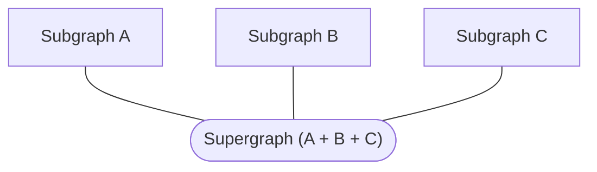

import AuthNotice from '../../shared/auth-notice.mdx';

A supergraph is a graph composed of multiple subgraphs:


```mermaid
graph BT;
  gateway(["Supergraph (A + B + C)"]);
  serviceA[Subgraph A];
  serviceB[Subgraph B];
  serviceC[Subgraph C];
  gateway --- serviceA & serviceB & serviceC;
```

Rover commands that interact with supergraphs begin with `rover supergraph`. These commands primarily deal with [supergraph schemas](/federation/federated-schemas).

## Fetching a supergraph schema from GraphOS

### `supergraph fetch`

<AuthNotice />

You can use Rover to fetch the supergraph schema of any federated GraphOS Studio variant it has access to. Run the `supergraph fetch` command, like so:

```bash
rover supergraph fetch my-supergraph@my-variant
```

To fetch a supergraph's API schema instead, use [`graph fetch`](./graphs/#fetching-a-schema). [Learn about different schema types.](/federation/federated-schemas)

The argument `my-supergraph@my-variant` in the example above specifies the ID of the Studio graph you're fetching from, along with which [variant](/graphos/graphs/#variants) you're fetching.

<Note>

You can omit `@` and the variant name. If you do, Rover uses the default variant, named `current`.

</Note>

## Composing a supergraph schema

### `supergraph compose`

You can use the `supergraph compose` command to [compose](/federation/federated-types/composition/) a supergraph schema based on a [supergraph configuration file](#yaml-configuration-file), like so:

```bash
rover supergraph compose --config ./supergraph.yaml
```

You can also pass config via stdin:

```bash
cat ./supergraph.yaml | rover supergraph compose --config -
```

### From a Studio variant

You can optionally pass a variant's graph ref to download each subgraph's SDL and compose the supergraph SDL like so:

```bash
rover supergraph compose --graph-ref platform@staging
```

You can optionally pass a [YAML configuration file](#yaml-configuration-file) to override specific subgraphs or add a new one.
This is useful for testing new subgraph schemas before publishing them.

For example, given a `supergraph_override.yaml` file like this:

```yaml title="supergraph_override.yaml" showLineNumbers=false
subgraphs:
  products:
    routing_url: http://localhost:4000
    schema:
      file: ./products.graphql
```

You can override a variant's published `products` subgraph like so:

```bash showLineNumbers=false
rover supergraph compose \
  --graph-ref docs-example-graph@current \
  --config path/to/supergraph_override.yaml

```

Note that you only need to set `routing_url` if you want to change it from the routing URL registered for the subgraph in GraphOS.

### YAML configuration file

The supergraph configuration file (often referred to as `supergraph.yaml`) includes configuration options for each of your [subgraphs](/federation/building-supergraphs/subgraphs-overview/). The following example file configures a supergraph with two subgraphs (`films` and `people`):

```yaml title="supergraph.yaml"
federation_version: =2.3.2
subgraphs:
  films:
    routing_url: https://films.example.com
    schema:
      file: ./films.graphql
  people:
    routing_url: https://people.example.com
    schema:
      file: ./people.graphql
```

In the above example, The YAML file specifies each subgraph's public-facing URL (`routing_url`), along with the path to its schema (`schema.file`).

A single configuration file can pull subgraph schemas from a variety of sources. For example, here's a configuration that includes subgraph schemas from three different types of sources:

```yaml title="supergraph.yaml"
federation_version: =2.3.2
subgraphs:

  # Local .graphql file
  films:
    routing_url: https://films.example.com
    schema:
      file: ./films.graphql

  # Subgraph introspection
  people:
    routing_url: https://example.com/people  # <- can be omitted if the same as introspection URL
    schema:
      subgraph_url: http://127.0.0.1:4002
      introspection_headers:  # Optional headers to include in introspection request
        Authorization: Bearer ${env.PEOPLE_AUTH_TOKEN}

  # GraphOS Studio graph ref
  actors:
    routing_url: http://localhost:4005  # <- can be omitted if matches existing URL in Studio
    schema:
      graphref: mygraph@current
      subgraph: actors
```

#### Variable expansion

The `supergraph.yaml` file supports variable expansion using [the same syntax as GraphOS Router](/router/configuration/overview/#variable-expansion).

To preview how Rover resolves these references, use [`supergraph config expand`](#supergraph-config-expand).

### Output format

By default, `rover supergraph compose` outputs a [supergraph schema](/federation/federated-schemas) document to `stdout`. You provide this artifact to [`@apollo/gateway`](/apollo-server/using-federation/api/apollo-gateway/) or the [🦀 GraphOS Router](/router/) on startup.

<Caution>

Your router/gateway fails to start up if you provide it with a supergraph schema that it doesn't support. To ensure compatibility, we recommend that you always test launching your router/gateway in a CI pipeline with the supergraph schema it will ultimately use in production.

</Caution>

You can save the schema output to a local `.graphql` file like so:

```bash
# Creates prod-schema.graphql or overwrites if it already exists
rover supergraph compose --config ./supergraph.yaml --output prod-schema.graphql
```

For more on passing values via `stdout`, see [Using `stdout`](../conventions#using-stdout).

### Federation 2 ELv2 license

The first time you use Federation 2 (or Federation 3) composition on a particular machine, Rover prompts you to accept the terms and conditions of the [ELv2 license](https://www.apollographql.com/docs/resources/elastic-license-v2-faq/). On future invocations, Rover remembers that you already accepted the license and doesn't prompt you again (even if you update Rover).

<Note>

CI systems wipe away any persisted Rover configuration on each run, and they can't accept the interactive ELv2 prompt. To automatically accept the prompt in CI, do any of the following:

- Set the environment variable `APOLLO_ELV2_LICENSE=accept` in your CI environment.
- Include `--elv2-license accept` in your `rover supergraph compose` command, or in the [`rover plugin install`](/rover/commands/plugin#plugin-install) command that installs the `supergraph` plugin ahead of time.
- Run `yes | rover supergraph compose`

</Note>

### The `supergraph` plugin

Composition runs in the ELv2-licensed `supergraph` plugin (built from the [federation-rs source](https://github.com/apollographql/federation-rs)). If the plugin isn't installed, `rover supergraph compose` downloads it and prints a warning that a future version of Rover will stop downloading plugins automatically. To avoid the download and the warning, install the plugin ahead of time, for example in your CI setup, with the [`rover plugin install` command](/rover/commands/plugin#plugin-install):

```bash
rover plugin install supergraph@=2.9.3 --elv2-license accept
```

When the command downloads the plugin, it warns:

```
Warning: Rover downloaded the `supergraph` plugin v2.9.3 because `APOLLO_ROVER_ALLOW_AUTOMATIC_DOWNLOAD` isn't set. A future version of Rover will not install plugins automatically. Install plugins ahead of time with `rover plugin install supergraph@=2.9.3`, or set `APOLLO_ROVER_ALLOW_AUTOMATIC_DOWNLOAD` to `true` to keep downloading them or `false` to stop now.
```

To keep downloading without the warning, or to stop downloading, set `APOLLO_ROVER_ALLOW_AUTOMATIC_DOWNLOAD`. For details, see [Automatic downloads](/rover/commands/plugin#automatic-downloads).

Rover looks for the plugin in the project's `.rover/bin/` directory first, then in the global `$APOLLO_HOME/.rover/bin/` directory (by default, `~/.rover/bin/`). See [Where plugins are installed](/rover/commands/plugin#where-plugins-are-installed).

Each run reports the plugin it used on `stderr`:

```
Using the `supergraph` plugin v2.9.3 (already installed).
```

The line ends with `(downloaded)` when Rover downloaded the plugin during the run. With `--format json`, the same facts appear under `data.plugins`, with each plugin's `name`, `version`, `source`, `level`, and `path`. For details, see [Output](/rover/commands/plugin#output).

### Setting a composition version

Rover composes with the federation version from the first of these that's set:

1. The `--federation-version` option
2. `federation_version` in your [supergraph.yaml](#yaml-configuration-file)
3. The `supergraph` version [declared in `rover.yaml`](/rover/commands/plugin#declaring-plugins-in-roveryaml), in the project or globally

When `supergraph.yaml` and `rover.yaml` both set a version and they disagree, Rover uses `supergraph.yaml` and warns:

```
warning: `supergraph.yaml` sets `federation_version: =2.9.3`, overriding the `supergraph` version declared in `rover.yaml`.
```

The command composes with Federation 2, provided by the [`@apollo/composition`](https://www.npmjs.com/package/@apollo/composition) library, or with Federation 3 when you set a Federation 3 version, such as `federation_version: =3.0.0-preview.1` or `--federation-version 3`. Federation 3 is under the same ELv2 license.

<Note>

- The federation version you specify must not exceed the highest version supported by your router. Make sure to update your router before incrementing your `federation_version`. For details, see this [support table](/router/federation-version-support).
- Federation 1 is no longer supported. Specifying `1`, `latest-1`, `latest-0`, an exact `=0.x.y` version, or an exact `=1.x.y` version fails with a message that Federation 1 is no longer supported ([`E064`](/rover/errors#e064)). To migrate your subgraphs, see [Moving to Federation 2](/federation/federation-2/moving-to-federation-2).
- If you don't pin an exact `federation_version`, Rover composes with the newest matching release and warns you. A new federation release can change your supergraph schema without your input, so pin an exact version for anything beyond local prototyping.

</Note>

#### Automatic updates

Unless you've [turned automatic downloads off](/rover/commands/plugin#automatic-downloads), when you don't specify an exact `federation_version`, Rover asks the Apollo plugin registry at `https://rover.apollo.dev` (or the host set by [`APOLLO_ROVER_DOWNLOAD_HOST`](/rover/configuring#supported-environment-variables)) for the latest matching composition version each time it runs, so you pick up a new release as soon as it's available.

With automatic downloads turned off, a floating version such as `2` uses the newest matching release that's already installed.

This auto-update flow will cause issues if you don't update your router version prior to updating your composition pipeline.
Apollo strongly recommends always specifying an exact `federation_version`.

#### Preventing auto-updates

To make sure Rover never downloads a plugin or contacts the plugin registry, for example on a slow or nonexistent network connection, pass the `--skip-update` flag to `rover supergraph compose`, or set the `APOLLO_ROVER_SKIP_UPDATE` environment variable to `1` or `true`. This applies even when `APOLLO_ROVER_ALLOW_AUTOMATIC_DOWNLOAD` is `true`.

Under `--skip-update`, Rover uses the version from `supergraph.yaml` or `rover.yaml` as usual, and uses the newest installed release that matches it. If none is installed, the command fails with [`E058`](/rover/errors#e058), naming the directories it searched:

```
error[E058]: Error when updating Federation Version

Caused by:
    0: Couldn't obtain the `supergraph` plugin
    1: Rover needs the `supergraph` plugin v2.9.3, but it isn't installed in `/work/app/.rover/bin` or `/home/me/.rover/bin` and downloads are disabled by `--skip-update`.
        Run `rover plugin install supergraph@=2.9.3` to install it ahead of time, or re-run without `--skip-update` to let Rover download it.
```

## Configuration awareness in your text editor

### `supergraph config schema`

You can use Rover to generate a JSON schema for config validation in your text editor. This schema helps you format the YAML file correctly and also provides content assist.

Generate the schema with the following command:

```bash
rover supergraph config schema
```

After you generate the schema, configure your text editor. Here are the instructions for some commonly used editors:

- [Visual Studio Code](https://code.visualstudio.com/docs/languages/json#_json-schemas-and-settings)
- [Emacs](https://emacs-lsp.github.io/lsp-mode/page/lsp-yaml)
- [IntelliJ](https://www.jetbrains.com/help/idea/json.html#ws_json_using_schemas)
- [Sublime](https://github.com/sublimelsp/LSP-yaml)
- [Vim](https://github.com/Quramy/vison)

## Expanding a configuration

### `supergraph config expand`

Your `supergraph.yaml` file can include [variable references](#variable-expansion) such as `${env.PRODUCTS_URL}` and `${file.path}`. To see how Rover resolves these references—without running composition—use `supergraph config expand`:

```bash
rover supergraph config expand --config ./supergraph.yaml
```

Rover prints the configuration with every reference expanded. This is useful for confirming that the correct environment variables and files are picked up before you compose. Pass `-` to `--config` to read the configuration from `stdin` instead of a file.

By default the expanded configuration is printed as YAML. For example, given this `supergraph.yaml`, with `PRODUCTS_ROUTING_URL` set to `https://products.example.com` and `PRODUCTS_AUTH_TOKEN` unset:

```yaml title="supergraph.yaml"
federation_version: =2.9.0
subgraphs:
  products:
    routing_url: ${env.PRODUCTS_ROUTING_URL}
    schema:
      subgraph_url: ${env.PRODUCTS_ROUTING_URL}
      introspection_headers:
        Authorization: ${env.PRODUCTS_AUTH_TOKEN:-default-token}
  users:
    routing_url: http://localhost:4002
    schema:
      file: ./users.graphql
```

Rover prints:

```
federation_version: =2.9.0
subgraphs:
  products:
    routing_url: https://products.example.com
    schema:
      subgraph_url: https://products.example.com
      introspection_headers:
        Authorization: default-token
  users:
    routing_url: http://localhost:4002
    schema:
      file: ./users.graphql
```

Add `--format json` to receive the same YAML, as a single string, in the `expanded_config` field of `data` instead:

```json
{
  "json_version": "1",
  "data": {
    "expanded_config": "federation_version: =2.9.0\nsubgraphs:\n  products:\n    routing_url: https://products.example.com\n    schema:\n      subgraph_url: https://products.example.com\n      introspection_headers:\n        Authorization: default-token\n  users:\n    routing_url: http://localhost:4002\n    schema:\n      file: ./users.graphql\n",
    "success": true
  },
  "error": null
}
```