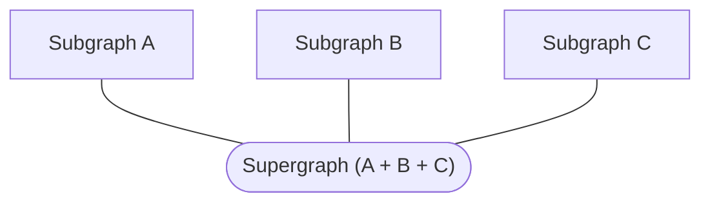

A **supergraph** (also called a federated graph) is a graph composed of multiple **subgraphs**:



Rover template commands help you create new subgraphs from templated projects in various [federation-compatible implementations](/federation/building-supergraphs/supported-subgraphs).

This feature helps you quickly start up a new GraphQL project or explore various subgraph implementations. If you want to contribute a new template, [open an issue here](https://github.com/apollographql/rover/issues/new/choose)!

## Create a new subgraph

Run `rover template use <PATH>` to generate the boilerplate for a new subgraph. You can either use the guided wizard experience to select a template, or specify a template with the `--template` flag.

### Using the wizard

Run `rover template use <PATH>` to start a wizard that helps you create a new subgraph project. The wizard walks you through a series of questions to help you choose a template.

```bash
rover template use my-new-subgraph
```

By default, the wizard prompts you for which programming language to use for your project. You can optionally provide a `--language` option to skip this prompt.

> Run `rover template use --help` to see a list of available languages.

```shell
rover template use "my-new-python-subgraph" --language=python
```

### Skipping the wizard

If you know exactly which template you want to use, you can specify the `--template` option to skip the wizard:

```shell
rover template use "my-new-apollo-server-subgraph" --template="subgraph-javascript-apollo-server"
```

> Use `rover template list` to see a list of available templates.

## Listing available templates

The `rover template list` command lists each available template with its corresponding ID (which you can provide to the `--template` option of `rover template use`). It also displays each template's name, language, and Repo URL. To learn more about a specific template, go to its repo URL and see its `README.md` file.

This command accepts the same `--language` option as `rover template use` to filter the list of templates.

> For a machine-readable output, use the `--json` flag.
