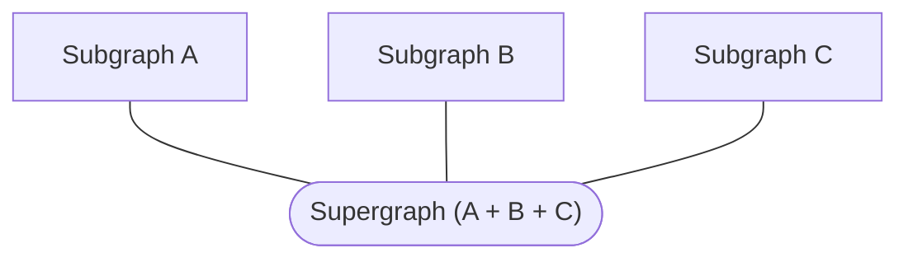

A _supergraph_ (also called a federated graph) is a graph composed of multiple _subgraphs_:



Rover template commands help you create new subgraphs from templated projects in various [federation-compatible implementations](/federation/building-supergraphs/supported-subgraphs).

This feature helps you quickly start up a new GraphQL project or explore various subgraph implementations. If you want to contribute a new template, [open an issue here](https://github.com/apollographql/rover/issues/new/choose)!

<SummitCallout
  topic="getting subgraphs set up quickly"
  workshopName="GraphOS & your internal developer platform"
  URL="https://reg.summit.graphql.com/flow/apollo/summit24/AttendeePortal/page/catalog/session/1712945783253001ScHT"
/>

## Create a new subgraph

Run `rover template use <PATH>` to generate the boilerplate for a new subgraph. You can either use the guided wizard experience to select a template, or specify a template with the `--template` flag.

### Using the wizard

Run `rover template use <PATH>` to start a wizard that helps you create a new subgraph project. The wizard walks you through a series of questions to help you choose a template.

```bash
rover template use my-new-subgraph
```

By default, the wizard prompts you for which programming language to use for your project. You can optionally provide a `--language` option to skip this prompt.

Run `rover template use --help` to see a list of available languages.

```shell
rover template use my-new-python-subgraph --language python
```

### Skipping the wizard

If you know exactly which template you want to use, you can specify the `--template` option to skip the wizard:

```shell
rover template use my-new-javascript-subgraph --template subgraph-javascript-apollo-server
```

Use `rover template list` to see a list of available templates.

## Listing available templates

The `rover template list` command lists each available template with its corresponding ID (which you can provide to the `--template` option of `rover template use`). It also displays each template's name, language, and Repo URL. To learn more about a specific template, go to its repo URL and see its `README.md` file.

This command accepts the same `--language` option as `rover template use` to filter the list of templates.

For a machine-readable output, use the `--json` flag.

Templates are currently available for the following libraries and languages:

| Language   | Name                                                                                   | ID                                   | Template Repository                                                                                              |
|------------|----------------------------------------------------------------------------------------|--------------------------------------|------------------------------------------------------------------------------------------------------------------|
| C#         | [Hot Chocolate (Annotations)](https://chillicream.com/docs/hotchocolate/)              | `subgraph-csharp-hot-chocolate`      | [View repository](https://github.com/apollographql/subgraph-template-dotnet-hotchocolate-annotation-boilerplate) |
| Go         | [Go (gqlgen)](https://gqlgen.com/getting-started/)                                     | `subgraph-go-gqlgen`                 | [View repository](https://github.com/apollographql/subgraph-template-go-gqlgen-boilerplate)                      |
| Java       | [Spring GraphQL](https://spring.io/projects/spring-graphql)                            | `subgraph-java-spring-graphql`       | [View repository](https://github.com/apollographql/subgraph-template-java-spring-graphql-boilerplate)            |
| JavaScript | [Apollo Server (JS)](https://www.apollographql.com/docs/apollo-server/)                | `subgraph-javascript-apollo-server`  | [View repository](https://github.com/apollographql/subgraph-template-javascript-apollo-server-boilerplate)       |
| Kotlin     | [GraphQL Kotlin](https://opensource.expediagroup.com/graphql-kotlin/docs/)             | `subgraph-graphql-kotlin`            | [View repository](https://github.com/apollographql/subgraph-template-graphql-kotlin-boilerplate)                 |
| Python     | [Strawberry with FastAPI](https://strawberry.rocks)                                    | `subgraph-python-strawberry-fastapi` | [View repository](https://github.com/strawberry-graphql/subgraph-template-strawberry-fastapi)                    |
| Python     | [Ariadne with FastAPI](https://ariadnegraphql.org)                                     | `subgraph-python-ariadne-fastapi`    | [View repository](https://github.com/patrick91/subgraph-template-ariadne-fastapi)                                |
| Rust       | [async-graphql with Axum](https://async-graphql.github.io/async-graphql/en/index.html) | `subgraph-rust-async-graphql`        | [View repository](https://github.com/apollographql/subgraph-template-rust-async-graphql)                         |
| TypeScript | [Apollo Server (TS)](https://www.apollographql.com/docs/apollo-server/)                | `subgraph-typescript-apollo-server`  | [View repository](https://github.com/apollographql/subgraph-template-typescript-apollo-server-boilerplate)       |
