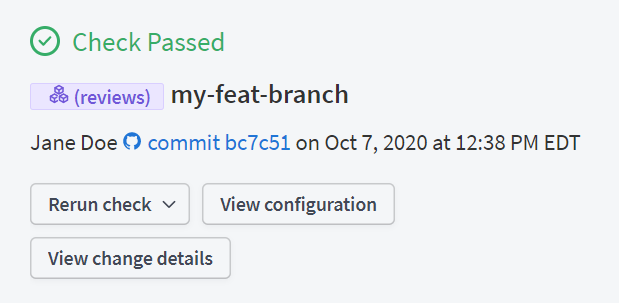

## Authenticating with GraphOS

### 1. Obtain an API key

All Rover commands that communicate with [GraphOS](/graphos/) require an API key. GraphOS supports graph, subgraph, and personal API keys.

- On your local development machine, use a personal API key.
- In shared environments like CI, use a graph or subgraph API key.

[Learn how to obtain an API key.](/graphos/api-keys/)

### 2. Provide the API key to Rover

You can provide your API key to Rover either via a [Rover command](#via-the-auth-command) (recommended for local development) or by setting an [environment variable](#with-an-environment-variable) (recommended for automation and CI).

<Note>

If you provide an API key via both methods, the environment variable takes precedence.

</Note>

#### Via the `auth` command

You can provide your API key to Rover by running the following command:

```shell
rover config auth
```

This method is recommended for local development. If you have more than one API key you want to use with Rover, you can assign those keys to different [configuration profiles](#configuration-profiles).

The `auth` command is interactive to prevent your API key from appearing in your terminal command history. Because it's interactive, we recommend using an [environment variable](#with-an-environment-variable) in automated environments such as CI.


#### With an environment variable


You can provide your API key to Rover by setting it as the value of the `APOLLO_KEY` environment variable.
See all [supported environment variables](#supported-environment-variables).

<ExpansionPanel title="Need help setting environment variables?">

  For CI/CD environments see [Using Rover in CI/CD](/rover/ci-cd).
  <Tabs>

    <Tab label="Linux/macOS">

      #### Session

      Run the following in your terminal:

      ```bash showLineNumbers=false
      export APOLLO_KEY="your_api_key_here"
      ```

      #### User profile

      1. Edit your shell profile file (`~/.bashrc`, `~/.zshrc`, etc.) to include the environment variables you want to set as exports:

          ```bash showLineNumbers=false
          export APOLLO_KEY="your_api_key_here"
          ```

      2. Apply changes before running any other commands.

          ```bash showLineNumbers=false
          source ~/.bashrc
          ```

    </Tab>
    <Tab label="Windows">
      #### Session (Command Prompt)

        ```cmd showLineNumbers=false
        set APOLLO_KEY=your_api_key_here
        ```

      #### Session (PowerShell)

      ```powershell showLineNumbers=false
      $env:APOLLO_KEY = "your_api_key_here"
      ```

      #### System Variables

      1. Search for **Environment Variables** in Windows search.
      1. Add new user or system variables with the appropriate names and values.

    </Tab>
  </Tabs>

</ExpansionPanel>

## Configuration profiles

You can create multiple _configuration profiles_ in Rover. Each configuration profile has its own associated API key, so you can use different configuration profiles when interacting with different graphs.

To specify which configuration profile to use for a particular command, use the `--profile` flag:

```shell
rover graph check my-company@prod --profile work
```

If you don't specify a configuration profile for a command, Rover uses the default profile (named `default`).

To view all commands for working with configuration profiles, run the following command:

```
rover config --help
```

[Learn more about `rover config` commands](./commands/config/).

## Logging

Rover supports the following levels of logging, in descending order of severity:

* `error`
* `warn`
* `info`
* `debug`
* `trace`

By default, Rover logs `error`, `warn`, and `info` messages. You can configure this behavior for a command by setting its minimum log level with the `--log` flag:

```
rover graph check my-graph@prod --schema ./schema.graphql --log debug
```

If Rover log messages are unhelpful or unclear, please leave us feedback in an
[issue on GitHub](https://github.com/apollographql/rover/issues/new/choose)!

## Configuring output

By default, Rover prints the main output of its commands to `stdout` in plaintext. It also prints a descriptor for that output to `stderr` if it thinks it's being operated by a human (it checks whether the terminal is TTY).

Every Rover command supports two options for configuring its output behavior:

- `--format`, for [setting the output format](#setting-output-format) (`plain` or `json`)
- `--output`, for [writing a command's output to a file](#setting-output-location) instead of `stdout`

### JSON output

<Note>

The `--format` option was added in Rover `v0.11.0`. Earlier versions of Rover use the `--output` option to set output format.

Current versions of Rover still support using `--output` this way, but that support is deprecated and will be removed in a future release.

</Note>

For more programmatic control over Rover's output, you can pass `--format json` to any command. Rover JSON output has the following minimal structure:

```json title="success_example"
{
  "json_version": "1",
  "data": {
    "success": true
  },
  "error": null
}
```

```json title="error_example"
{
  "json_version": "1",
  "data": {
    "success": false
  },
  "error": {
    "message": "An unknown error occurred.",
    "code": null
  }
}
```

As shown in `error_example` above, some Rover errors have a `null` error `code`. Despite this, your scripts should match on particular errors based on their `code` instead of their `message` (`message` strings are subject to change without bumping `json_version`).

If you frequently encounter un-coded errors, please [submit an issue](https://github.com/apollographql/rover/issues/new/choose).

#### JSON output fields

<table class="field-table api-ref">
  <thead>
    <tr>
      <th>Name /<br/>Type</th>
      <th>Description</th>
    </tr>
  </thead>

<tbody>

<tr>
<td>

##### `json-version`

`string`
</td>
<td>

Indicates the version of the JSON output's structure. A script can check this value to detect breaking changes.

Non-breaking additions might be made to Rover's JSON structure without incrementing `json_version`.

</td>
</tr>

<tr>
<td>

##### `data`

`Object`
</td>
<td>

Represents the command's result.

Always contains at least a `success` boolean field. Other present fields depend on the command.

Note that [`error`](#error) might be present even if `data.success` is `true`. Certain commands (e.g., `subgraph publish`) might result in _composition errors_ even if the command's primary action (e.g., publishing the schema to Apollo) succeeds. See [Command-specific JSON output](#command-specific-json-output).

</td>
</tr>


<tr>
<td>

##### `error`

`Object | null`
</td>
<td>

Represents any errors that occurred during the command's execution (or `null` if no errors occurred).

If present, always contains at least `message` and `code` fields. Other present fields depend on the command.

</td>
</tr>

</tbody>
</table>

#### Command-specific JSON output

Here's an example success output for `rover subgraph publish`:

```json title="success_example"
{
  "json_version": "1",
  "data": {
    "api_schema_hash": "a1bc0d",
    "supergraph_was_updated": true,
    "subgraph_was_created": true,
    "subgraph_was_updated": true,
    "success": true
  },
  "error": null
}
```

And here's an example error output:

```json title="error_example"
{
  "json_version": "1",
  "data": {
    "api_schema_hash": null,
    "subgraph_was_created": false,
    "subgraph_was_updated": true,
    "supergraph_was_updated": false,
    "success": true
  },
  "error": {
    "message": "Encountered 2 build errors while trying to build subgraph \"subgraph\" into supergraph \"name@current\".",
    "code": "E029",
    "details": {
      "build_errors": [
        {
          "message": "[Accounts] -> Things went really wrong",
          "code": "AN_ERROR_CODE",
          "type": "composition",
        },
        {
          "message": "[Films] -> Something else also went wrong",
          "code": null,
          "type": "composition"
        }
      ]
    }
  }
}
```

This particular `error` object includes `details` about what went wrong. Notice that even though errors occurred while executing this command, `data.success` is still `true`. That's because the errors are _build errors_ associated with composing the supergraph schema. Although composition failed, the subgraph publish itself succeeded.

#### Example `jq` script

You can combine the `--format json` flag with the [`jq`](https://stedolan.github.io/jq/) command line tool to create powerful custom workflows. For example, [this gist](https://gist.github.com/EverlastingBugstopper/d6aa0d9a49bcf39f2df53e1cfb9bb88a) demonstrates converting output from `rover {sub}graph check my-graph --format json` to Markdown.

### Writing to a file

The `--output` option enables you to specify a file destination for writing a Rover command's output:

```bash
rover supergraph compose --output ./supergraph-schema.graphql --config ./supergraph.yaml
```

If the specified file already exists, Rover overwrites it.

<Note>

This functionality is available in Rover `v0.11.0` and later. In earlier versions of Rover, the `--output` option instead provides the functionality that's now provided by the [`--format` option](#json-output).

Current versions of Rover still support using `--output` like `--format`, but that support is deprecated and will be removed in a future release.

</Note>

## Setting config storage location

Rover stores your configuration in a local file and uses it when making requests. By default, this file is stored in your operating system's default configuration directory, in a file named `.sensitive`.

You can override this file's location by setting the `APOLLO_CONFIG_HOME` environment variable. This can be useful for CI systems that don't give you access to default operating system directories.

```bash
# Stores config in ./myspecialconfig/rover.toml
APOLLO_CONFIG_HOME=./myspecialconfig/
```

## Git context

Rover sends non-confidential information about your Git environment to GraphOS when you run a `check` or `publish` command. This information is displayed in relevant views of the Studio UI, making it easier to track down where schema changes were proposed or published:



This Git information includes:

* The remote URL of your Git repository (stripped of any usernames/passwords)
* The current commit's SHA
* The committer of the current SHA
* The current branch name

To see these values, run any `check` or `publish` command with the `--log trace` option.

### Overriding

None of this information should be sensitive, but if you want to override these values, you can set the following [environment variables](#supported-environment-variables):

* `APOLLO_VCS_REMOTE_URL`
* `APOLLO_VCS_BRANCH`
* `APOLLO_VCS_COMMIT`
* `APOLLO_VCS_AUTHOR`

### Non-Git version control

If you use a version control system besides Git, you can use the environment variables described in [Git context](#git-context) to set similar information relevant to your VCS tool,

Currently, only Git is fully supported by GraphOS Studio.

## Bypassing TLS/SSL validation

In some configurations (especially in internal networks), you might need Rover to communicate over encrypted channels (e.g., HTTPS) while avoiding strict digital certificate verifications that validate hostnames. You might even need to bypass digital certificate validation entirely.

**This is not recommended and considered much less secure.** However, for cases where it's necessary, you can use the following flags to configure how Rover validates HTTPS requests:

- The `--insecure-accept-invalid-hostnames` flag disables hostname validation. If hostname verification is not used, any valid certificate for any site is trusted for use from any other. This introduces a significant vulnerability to person-in-the-middle attacks.

- The `--insecure-accept-invalid-certs` flag disables certificate validation. If invalid certificates are trusted, any certificate for any site is trusted for use. This includes expired certificates. This introduces significant vulnerabilities, and should only be used as a last resort.

## Increasing request timeouts

By default, Rover times out requests to the GraphOS Studio API and your graph endpoints after 30 seconds. If you're executing a command that might take longer than 30 seconds to process, you can increase this timeout with the `--client-timeout` option:

```sh
rover subgraph check my-graph --validation-period 1m --client-timeout=60
```

## Supported environment variables

You can configure Rover's behavior by setting the environment variables listed below.

If present, an environment variable's value takes precedence over all other methods of configuring the associated behavior.

| Name                        | Value          |
|-----------------------------|----------------|
| `APOLLO_HOME` | The path to the parent directory of Rover's binary. The default value is your operating system's default home directory. Rover will install itself in a folder called `.rover` inside the directory specified. |
| `APOLLO_CONFIG_HOME` | The path where Rover's configuration is stored. The default value is your operating system's default configuration directory. |
| `APOLLO_GRAPH_REF` | A graph ref passed to `rover dev` command. [Learn more](./commands/dev#understanding---graph-ref-vs-apollo_graph_ref) |
| `APOLLO_KEY` | The API key that Rover should use to authenticate with GraphOS Studio. |
| `APOLLO_TELEMETRY_DISABLED` | Set to `true` if you don't want Rover to collect anonymous usage data. |
| `APOLLO_VCS_REMOTE_URL` | The URL of your project's remote repository. See [Git context](#git-context). |
| `APOLLO_VCS_BRANCH` | The name of the version-controlled branch. See [Git context](#git-context). |
| `APOLLO_VCS_COMMIT` | The long identifier (SHA in Git) of the commit. See [Git context](#git-context). |
| `APOLLO_VCS_AUTHOR` | The name and email of a commit's author (e.g., `Jane Doe <jane@example.com>`). See [Git context](#git-context). |
| `NO_COLOR` | Set to `1` if you don't want Rover to print color. |
