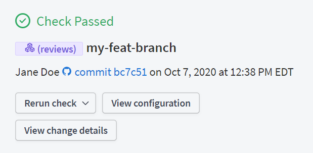

## Authenticating with GraphOS

### 1. Obtain an API key

All Rover commands that communicate with [GraphOS](/graphos/) require an API key. GraphOS supports graph, subgraph, and personal API keys.

- On your local development machine, use a personal API key.
- In shared environments like CI, use a graph or subgraph API key.

[Learn how to obtain an API key.](/graphos/platform/access-management/api-keys)

### 2. Provide the API key to Rover

You can provide your API key to Rover either via a [Rover command](#via-the-auth-command) (recommended for local development) or by setting an [environment variable](#with-an-environment-variable) (recommended for automation and CI).

<Note>

If you provide an API key via both methods, the environment variable takes precedence.

</Note>

#### Via the `auth` command

You can provide your API key to Rover by running the following command:

```shell
rover config auth
```

This method is recommended for local development. If you have more than one API key you want to use with Rover, you can assign those keys to different [configuration profiles](#configuration-profiles).

The `auth` command is interactive to prevent your API key from appearing in your terminal command history. Because it's interactive, we recommend using an [environment variable](#with-an-environment-variable) in automated environments such as CI.


#### With an environment variable


You can provide your API key to Rover by setting it as the value of the `APOLLO_KEY` environment variable.
See all [supported environment variables](#supported-environment-variables).

<ExpansionPanel title="Need help setting environment variables?">

  For CI/CD environments see [Using Rover in CI/CD](/rover/ci-cd).
  <Tabs>

    <Tab label="Linux/macOS">

      #### Session

      Run the following in your terminal:

      ```bash showLineNumbers=false
      export APOLLO_KEY="your_api_key_here"
      ```

      #### User profile

      1. Edit your shell profile file (`~/.bashrc`, `~/.zshrc`, etc.) to include the environment variables you want to set as exports:

          ```bash showLineNumbers=false
          export APOLLO_KEY="your_api_key_here"
          ```

      2. Apply changes before running any other commands.

          ```bash showLineNumbers=false
          source ~/.bashrc
          ```

    </Tab>
    <Tab label="Windows">
      #### Session (Command Prompt)

        ```cmd showLineNumbers=false
        set APOLLO_KEY=your_api_key_here
        ```

      #### Session (PowerShell)

      ```powershell showLineNumbers=false
      $env:APOLLO_KEY = "your_api_key_here"
      ```

      #### System Variables

      1. Search for **Environment Variables** in Windows search.
      1. Add new user or system variables with the appropriate names and values.

    </Tab>
  </Tabs>

</ExpansionPanel>

## Configuration profiles

You can create multiple _configuration profiles_ in Rover. Each configuration profile has its own associated API key, so you can use different configuration profiles when interacting with different graphs.

To specify which configuration profile to use for a particular command, use the `--profile` flag:

```shell
rover graph check my-company@prod --profile work
```

`--profile` is accepted by every Rover command, not only ones that talk to GraphOS.

If you don't specify a configuration profile for a command, Rover uses the default profile (named `default`).

### Settings in a profile

A profile can also store non-secret settings alongside its API key, so a profile pointed at a different GraphOS environment can carry its own registry URL, timeouts, and so on. Every setting marked in the **Profile** column of the [environment variables table](#variables) can be stored this way, with [`rover config set`](./commands/config#config-set):

```shell
rover config set APOLLO_REGISTRY_URL https://registry.staging.example.com --profile staging
```

A profile you name with `--profile` outranks the [project file](#project-settings), which outranks the `default` profile. Flags and environment variables outrank all three. See [How Rover chooses a setting's value](#how-rover-chooses-a-settings-value) for the full order, and run `rover config show` to see which source supplied each setting.

To view all commands for working with configuration profiles, run the following command:

```
rover config --help
```

[Learn more about `rover config` commands](./commands/config/).

## Project settings

A project can carry its own settings, so everyone working in the same repository uses the same registry, timeouts, and plugin download host without configuring each machine. Add a `settings:` section to a `rover.yaml` file in a `.rover/` directory at your project's root:

```yaml title=".rover/rover.yaml"
settings:
  APOLLO_REGISTRY_URL: https://registry.example.com
  APOLLO_ROVER_DOWNLOAD_HOST: https://mirror.example.com
  APOLLO_CHECKS_TIMEOUT_SECONDS: 600
```

Rover finds the file by looking for a `.rover/` directory in the current directory and then in each parent directory, stopping at your home directory, so it applies to commands run anywhere in the project. `rover plugin install --manifest-path <FILE>` uses the settings in the file it names instead. A setting in the file applies to everyone who runs Rover there, unless a flag, an environment variable, or a profile they name with `--profile` overrides it. See [How Rover chooses a setting's value](#how-rover-chooses-a-settings-value).

- **Names.** A key is a setting's environment variable name, such as `APOLLO_REGISTRY_URL`, or that name in all lowercase, such as `apollo_registry_url`. The lowercase spelling is accepted in `rover.yaml` only. Using both spellings of the same setting in one file is an error (`E061`).
- **Values.** A value has the setting's type: a URL, a whole number of seconds, a graph ref, or `true`/`false`. A stored boolean is a real `true` or `false`; see [Boolean values](#boolean-values). Rover checks a value when a command uses the setting, and fails with an error naming the file and the key if it's invalid.
- **Which settings.** Only settings marked in the **Project** column of the [environment variables table](#variables) can be set here. Rover warns about any other key and ignores it, so a file written for a newer version of Rover doesn't break an older one.
- **No credentials.** The file is meant to be committed, so Rover refuses to read a credential from it. `APOLLO_KEY`, `APOLLO_CLIENT_ID`, or `APOLLO_CLIENT_SECRET` under `settings:` fails every command in the project (`E060`). Set your API key in the environment or in a profile instead; see [Authenticating with GraphOS](#authenticating-with-graphos).
- **Project only.** A `settings:` section in your user-level `rover.yaml` (`~/.rover/rover.yaml`, or `.rover/rover.yaml` under `APOLLO_HOME` if you've set it) is ignored with a warning. To store settings for yourself rather than for a project, use a [profile](#settings-in-a-profile).

If Rover can't read or parse the project's `rover.yaml`, it prints a warning and applies none of its settings. The command still runs.

## Configuration notices

When a setting's value sends Rover somewhere you might not expect, Rover prints a one-line note to stderr the first time it uses that setting. This happens when:

- a profile or the project file points a network destination, such as the registry URL or the plugin download host, at something other than its default:

  ```
  Note: `rover.yaml` sets `APOLLO_ROVER_DOWNLOAD_HOST` to `https://mirror.example.com`.
  ```

- an environment variable overrides a value set by a profile you named with `--profile`, or by the project file:

  ```
  Note: `APOLLO_REGISTRY_URL` from the environment overrides the value set in profile `staging`.
  ```

Notices go to stderr only. They never appear in `--format json` output and never change a command's exit code. To turn them off, pass `--no-config-notices` or set `APOLLO_ROVER_NO_CONFIG_NOTICES` to `true`. A profile or project file can't turn them off.

## Logging

Rover supports the following levels of logging, in descending order of severity:

* `error`
* `warn`
* `info`
* `debug`
* `trace`

By default, Rover logs `error`, `warn`, and `info` messages. You can configure this behavior for a command by setting its minimum log level with the `--log` flag:

```
rover graph check my-graph@prod --schema ./schema.graphql --log debug
```

If Rover log messages are unhelpful or unclear, please leave us feedback in an
[issue on GitHub](https://github.com/apollographql/rover/issues/new/choose)!

## Configuring output

By default, Rover prints the main output of its commands to `stdout` in plaintext. It also prints a descriptor for that output to `stderr` if it thinks it's being operated by a human (it checks whether the terminal is TTY).

Every Rover command supports two options for configuring its output behavior:

- `--format`, for [setting the output format](#setting-output-format) (`plain` or `json`)
- `--output`, for [writing a command's output to a file](#setting-output-location) instead of `stdout`

### JSON output

<Note>

The `--format` option was added in Rover `v0.11.0`. Earlier versions of Rover use the `--output` option to set output format.

Current versions of Rover still support using `--output` this way, but that support is deprecated and will be removed in a future release.

</Note>

For more programmatic control over Rover's output, you can pass `--format json` to any command. Rover JSON output has the following minimal structure:

```json title="success_example"
{
  "json_version": "1",
  "data": {
    "success": true
  },
  "error": null
}
```

```json title="error_example"
{
  "json_version": "1",
  "data": {
    "success": false
  },
  "error": {
    "message": "An unknown error occurred.",
    "code": null
  }
}
```

As shown in `error_example` above, some Rover errors have a `null` error `code`. Despite this, your scripts should match on particular errors based on their `code` instead of their `message` (`message` strings are subject to change without bumping `json_version`).

If you frequently encounter un-coded errors, please [submit an issue](https://github.com/apollographql/rover/issues/new/choose).

#### JSON output fields

<table class="field-table api-ref">
  <thead>
    <tr>
      <th>Name /<br/>Type</th>
      <th>Description</th>
    </tr>
  </thead>

<tbody>

<tr>
<td>

##### `json-version`

`string`
</td>
<td>

Indicates the version of the JSON output's structure. A script can check this value to detect breaking changes.

Non-breaking additions might be made to Rover's JSON structure without incrementing `json_version`.

</td>
</tr>

<tr>
<td>

##### `data`

`Object`
</td>
<td>

Represents the command's result.

Always contains at least a `success` boolean field. Other present fields depend on the command.

Note that [`error`](#error) might be present even if `data.success` is `true`. Certain commands (e.g., `subgraph publish`) might result in _composition errors_ even if the command's primary action (e.g., publishing the schema to Apollo) succeeds. See [Command-specific JSON output](#command-specific-json-output).

</td>
</tr>


<tr>
<td>

##### `error`

`Object | null`
</td>
<td>

Represents any errors that occurred during the command's execution (or `null` if no errors occurred).

If present, always contains at least `message` and `code` fields. Other present fields depend on the command.

When an error has underlying causes (the `Caused by:` lines shown in plain-text output), a `causes` field is included with an array of those cause messages, outermost first.

</td>
</tr>

</tbody>
</table>

#### Command-specific JSON output

Here's an example success output for `rover subgraph publish`:

```json title="success_example"
{
  "json_version": "1",
  "data": {
    "api_schema_hash": "a1bc0d",
    "supergraph_was_updated": true,
    "subgraph_was_created": true,
    "subgraph_was_updated": true,
    "success": true
  },
  "error": null
}
```

And here's an example error output:

```json title="error_example"
{
  "json_version": "1",
  "data": {
    "api_schema_hash": null,
    "subgraph_was_created": false,
    "subgraph_was_updated": true,
    "supergraph_was_updated": false,
    "success": true
  },
  "error": {
    "message": "Encountered 2 build errors while trying to build subgraph \"subgraph\" into supergraph \"name@current\".",
    "code": "E029",
    "details": {
      "build_errors": [
        {
          "message": "[Accounts] -> Things went really wrong",
          "code": "AN_ERROR_CODE",
          "type": "composition",
        },
        {
          "message": "[Films] -> Something else also went wrong",
          "code": null,
          "type": "composition"
        }
      ]
    }
  }
}
```

This particular `error` object includes `details` about what went wrong. Notice that even though errors occurred while executing this command, `data.success` is still `true`. That's because the errors are _build errors_ associated with composing the supergraph schema. Although composition failed, the subgraph publish itself succeeded.

#### Example `jq` script

You can combine the `--format json` flag with the [`jq`](https://stedolan.github.io/jq/) command line tool to create powerful custom workflows. For example, [this gist](https://gist.github.com/EverlastingBugstopper/d6aa0d9a49bcf39f2df53e1cfb9bb88a) demonstrates converting output from `rover {sub}graph check my-graph --format json` to Markdown.

### Writing to a file

The `--output` option enables you to specify a file destination for writing a Rover command's output:

```bash
rover supergraph compose --output ./supergraph-schema.graphql --config ./supergraph.yaml
```

If the specified file already exists, Rover overwrites it.

<Note>

This functionality is available in Rover `v0.11.0` and later. In earlier versions of Rover, the `--output` option instead provides the functionality that's now provided by the [`--format` option](#json-output).

Current versions of Rover still support using `--output` like `--format`, but that support is deprecated and will be removed in a future release.

</Note>

## Setting config storage location

Rover stores your configuration in a local file and uses it when making requests. By default, this file is stored in your operating system's default configuration directory, in a file named `.sensitive`.

You can override this file's location by setting the `APOLLO_CONFIG_HOME` environment variable. This can be useful for CI systems that don't give you access to default operating system directories.

```bash
# Stores config in ./myspecialconfig/rover.toml
APOLLO_CONFIG_HOME=./myspecialconfig/
```

## Git context

Rover sends non-confidential information about your Git environment to GraphOS when you run a `check` or `publish` command. This information is displayed in relevant views of the Studio UI, making it easier to track down where schema changes were proposed or published:



This Git information includes:

* The remote URL of your Git repository (stripped of any usernames/passwords)
* The current commit's SHA
* The committer of the current SHA
* The current branch name

To see these values, run any `check` or `publish` command with the `--log trace` option.

### Overriding

None of this information should be sensitive, but if you want to override these values, you can set the following [environment variables](#supported-environment-variables):

* `APOLLO_VCS_REMOTE_URL`
* `APOLLO_VCS_BRANCH`
* `APOLLO_VCS_COMMIT`
* `APOLLO_VCS_AUTHOR`

### Non-Git version control

If you use a version control system besides Git, you can use the environment variables described in [Git context](#git-context) to set similar information relevant to your VCS tool,

Currently, only Git is fully supported by GraphOS Studio.

## Bypassing TLS/SSL validation

In some configurations (especially in internal networks), you might need Rover to communicate over encrypted channels (e.g., HTTPS) while avoiding strict digital certificate verifications that validate hostnames. You might even need to bypass digital certificate validation entirely.

**This is not recommended and considered much less secure.** However, for cases where it's necessary, you can use the following flags to configure how Rover validates HTTPS requests:

- The `--insecure-accept-invalid-hostnames` flag disables hostname validation. If hostname verification is not used, any valid certificate for any site is trusted for use from any other. This introduces a significant vulnerability to person-in-the-middle attacks.

- The `--insecure-accept-invalid-certs` flag disables certificate validation. If invalid certificates are trusted, any certificate for any site is trusted for use. This includes expired certificates. This introduces significant vulnerabilities, and should only be used as a last resort.

## Increasing request timeouts

By default, Rover times out requests to the GraphOS Studio API and your graph endpoints after 30 seconds. If you're executing a command that might take longer than 30 seconds to process, you can increase this timeout with the `--client-timeout` option:

```sh
rover subgraph check my-graph --validation-period 1m --client-timeout=60
```

## Supported environment variables

Most of Rover's behavior can be configured with an environment variable, and most environment variables have a matching flag, shown in the table below. A flag's `--help` text also names its environment variable.

### How Rover chooses a setting's value

For each setting, Rover uses the first of these sources that supplies a value:

1. A flag passed on the command line.
2. The setting's environment variable. A variable that's set to an empty value still counts as set.
3. A profile named with `--profile`, including `--profile default` typed out.
4. The project file: the `settings:` section of the `rover.yaml` in your project's `.rover/` directory.
5. The `default` profile, when `--profile` isn't passed.
6. Rover's built-in default.

Only the settings marked in the **Profile** and **Project** columns below can come from a profile or the project file. For every other setting, the chain is just the flag, then the environment variable, then the built-in default. To see each setting's effective value and the source that supplied it, run `rover config show`.

<Note>

This is separate from [API key resolution](#2-provide-the-api-key-to-rover), which has its own precedence and isn't affected by the above.

</Note>

### Boolean values

A boolean environment variable is set by `1` or `true` (case-insensitive) and unset by `0`, `false`, an empty value, or leaving it unset. There are two exceptions:

- `APOLLO_TELEMETRY_DISABLED` disables telemetry when it's set to any value, including `false` or an empty value. Only leaving it unset keeps telemetry enabled.
- `NO_COLOR` and `APOLLO_NO_COLOR` follow the cross-tool `NO_COLOR` convention: an empty value, `0`, and `false` count as unset, and anything else turns color off.

A boolean stored in a profile or the project file is always a real `true` or `false`, whatever its environment variable's rule. So `APOLLO_TELEMETRY_DISABLED: false` in a profile or project file keeps telemetry **enabled**, even though `APOLLO_TELEMETRY_DISABLED=false` in the environment disables it.

### Variables

| Name | Flag | Profile | Project | Value |
|------|------|:-------:|:-------:|-------|
| `APOLLO_HOME` | `--rover-home` | | | The path to the parent directory of Rover's binary. The default value is your operating system's default home directory. Rover will install itself in a folder called `.rover` inside the directory specified. |
| `APOLLO_CONFIG_HOME` | `--config-home` | | | The path where Rover's configuration is stored. The default value is your operating system's default configuration directory. |
| `APOLLO_KEY` | | | | The API key that Rover should use to authenticate with GraphOS Studio. |
| `APOLLO_REGISTRY_URL` | `--registry-url` | ✓ | ✓ | Overrides the GraphOS registry endpoint Rover sends requests to. |
| `APOLLO_TELEMETRY_URL` | `--telemetry-url` | ✓ | ✓ | Overrides the endpoint anonymous usage telemetry is reported to. |
| `APOLLO_TELEMETRY_DISABLED` | `--telemetry-disabled` | ✓ | ✓ | Set if you don't want Rover to collect anonymous usage data. See [Boolean values](#boolean-values) for how its value is read. |
| `APOLLO_CHECKS_TIMEOUT_SECONDS` | `--checks-timeout` | ✓ | ✓ | Overrides how long, in whole seconds, `check`/`publish` polling waits before giving up. Defaults to `300`. |
| `APOLLO_CLIENT_TIMEOUT` | `--client-timeout` | ✓ | ✓ | Overrides the timeout (in seconds) for HTTP(S) requests. See [Increasing request timeouts](#increasing-request-timeouts). |
| `APOLLO_ROVER_DOWNLOAD_HOST` | `--download-host` | ✓ | ✓ | Overrides the host plugin binaries (the `router` and `supergraph` composition plugins) are downloaded from. |
| `APOLLO_TEMPLATES_API` | `--templates-api` (`rover template` only) | ✓ | ✓ | Overrides where `rover template` fetches project templates from. `rover init` fetches templates from GitHub and doesn't use this. |
| `APOLLO_GRAPH_REF` | | ✓ | ✓ | A graph ref passed to `rover dev` command. [Learn more](./commands/dev#understanding---graph-ref-vs-apollo_graph_ref) |
| `APOLLO_ROVER_DEV_ROUTER_VERSION` | `--router-version` (`rover dev` only) | | | Overrides the version of the GraphOS Router `rover dev` runs. |
| `APOLLO_ROVER_DEV_COMPOSITION_VERSION` | `--composition-version` (`rover dev` only) | | | Overrides the version of Apollo Federation `rover dev` uses for composition. `--federation-version` takes precedence over both. |
| `APOLLO_ROVER_DEV_MCP_VERSION` | `--mcp-version` (`rover dev` only) | | | Overrides the version of the Apollo MCP Server `rover dev --mcp` runs. |
| `APOLLO_VCS_REMOTE_URL` | `--vcs-remote-url` | | | The URL of your project's remote repository. See [Git context](#git-context). |
| `APOLLO_VCS_BRANCH` | `--vcs-branch` | | | The name of the version-controlled branch. See [Git context](#git-context). |
| `APOLLO_VCS_COMMIT` | `--vcs-commit` | | | The long identifier (SHA in Git) of the commit. See [Git context](#git-context). |
| `APOLLO_VCS_AUTHOR` | `--vcs-author` | | | The name and email of a commit's author (e.g., `Jane Doe <jane@example.com>`). See [Git context](#git-context). |
| `APOLLO_ROVER_NO_CONFIG_NOTICES` | `--no-config-notices` | | | Set to `true` to turn off [configuration notices](#configuration-notices). |
| `APOLLO_ROVER_ALLOW_AUTOMATIC_DOWNLOAD` | | ✓ | ✓ | Set to `true` to let a command that needs a plugin it doesn't have, such as `rover supergraph compose` or `rover dev`, download it. An explicit `rover plugin install` always downloads, whatever this is set to, and `--skip-update` still prevents a download. The environment variable can only turn this on. To turn it off, store `false` in a profile or the project file that [outranks](#how-rover-chooses-a-settings-value) the one that turned it on. |
| `APOLLO_LOG_LEVEL` | `--log` | | | Sets Rover's [log level](#logging). |
| `APOLLO_FORMAT` | `--format` | | | Sets Rover's [output format](#configuring-output) (`plain` or `json`). |
| `NO_COLOR` | `--no-color` | | | Set if you don't want Rover to print color. See [Boolean values](#boolean-values) for how its value is read. |
| `APOLLO_NO_COLOR` | `--no-color` | | | Same as `NO_COLOR`, with the same value rule. Checked in addition to, not instead of, `NO_COLOR`. |
