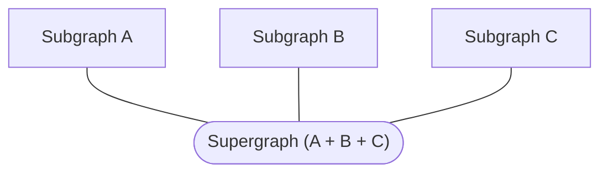

These conventions apply to all Rover commands.

## Terminology

### Graph / Subgraph / Supergraph

Rover provides commands for interacting with federated [`subgraph`s](./commands/subgraphs/) and [`supergraph`s](./commands/supergraphs/), along with commands for interacting with a monolithic (non-federated) [`graph`](./commands/graphs/).

A _supergraph_ is the composition of multiple _subgraphs_ in a [federated architecture](/federation/):



When working on a federated graph, you'll run most Rover commands on a particular subgraph (using a `subgraph` command), rather than on the whole composed supergraph. The `supergraph` commands are useful when working with [supergraph schemas](./commands/supergraphs/).

### Graph refs

Rover uses **graph refs** to refer to a particular variant of a particular graph in [GraphOS](/graphos/graphs/). A graph ref is a string with the following format:

```
graph_id@variant_name
```

**For example:** `docs-example-graph@staging`

All Rover commands that interact with GraphOS require a graph ref as their first positional argument.

## I/O

### Using `stdout`

Rover commands print to `stdout` in a predictable, portable format. This enables output to be used elsewhere (such as in another CLI, or as input to another Rover command). To help maintain this predictability, Rover prints progress logs to `stderr` instead of `stdout`.

To redirect Rover's output to a location other than your terminal, you can use the `--output <OUTPUT_FILE>` argument, the pipe `|` operator, or the redirect `>` operator.

#### Pipe `|`

Use the pipe operator to pass the `stdout` of one command directly to the `stdin` of another, like so:

```bash
rover graph introspect http://localhost:4000 | pbcopy
```

In this example, the output of the `introspect` command is piped to `pbcopy`, a MacOS command that copies a value to the clipboard. Certain Rover commands also accept values from `stdin`, as explained in [Using `stdin`](#using-stdin).

#### Output to a file

Use the `--output <OUTPUT_FILE>` argument to write command output to a file. 

```
rover graph fetch my-graph@prod --output schema.graphql
```

In this example, the schema returned by `graph fetch` is written to the file `schema.graphql`. If this file already exists, it's overwritten. Otherwise, it's created.

### Using `stdin`

Rover commands that take a file path as an option can instead accept input from `stdin`. To do so, pass `-` as the argument for the file path:

```
rover graph introspect http://localhost:4000 \
  | rover graph check my-graph --schema -
```

Notice the `-` after `--schema`. The schema returned by `graph introspect` is being passed as the `--schema` option to `graph check`, which normally takes a file rather than input from `stdin`.
