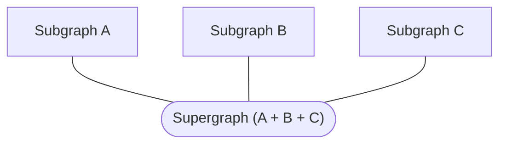

A **subgraph** is a graph that contributes to the composition of a federated **supergraph**:



Rover commands that interact with subgraphs begin with `rover subgraph`.

## Fetching a subgraph schema

### Fetching from Apollo Studio

> This requires first [authenticating Rover with Apollo Studio](./configuring/#authenticating-with-apollo-studio).

You can use Rover to fetch the current schema of any subgraph that belongs to a Studio graph and variant that Rover has access to.

Run the `subgraph fetch` command, like so:

```bash
rover subgraph fetch my-graph@my-variant --name accounts
```

The argument `my-graph@my-variant` in the example above is a [graph ref](./conventions/#graph-refs) that specifies the ID of the Studio graph you're fetching from, along with which [variant](https://www.apollographql.com/docs/studio/org/graphs/#managing-variants) you're fetching.

> You can omit `@` and the variant name. If you do, Rover uses the default variant, named `current`.

The `--name` option is also required. It must match the subgraph you're fetching the schema for.

### Fetching via enhanced introspection

If you need to obtain a running subgraph's schema, you can use Rover to execute an enhanced introspection query on it. This is especially helpful if the subgraph _doesn't_ define its schema via SDL (as is the case with [`graphql-kotlin`](https://github.com/ExpediaGroup/graphql-kotlin)).

Use the `subgraph introspect` command, like so:

```bash
rover subgraph introspect http://localhost:4001
```

The subgraph must be reachable by Rover. The subgraph does _not_ need to have introspection enabled.

> Unlike a standard introspection query, the result of `rover subgraph introspect` _does_ include certain directives (specifically, directives related to federation like `@key`). This is possible because the command uses a separate introspection mechanism provided by the [Apollo Federation specification](https://www.apollographql.com/docs/federation/federation-spec/#fetch-service-capabilities).

#### Including headers

If the endpoint you're trying to reach requires HTTP headers, you can use the `--header` (`-H`) flag to pass `key:value` pairs of headers. If you have multiple headers to pass, provide the flag multiple times. If a header includes any spaces, the pair must be quoted.

```shell
rover subgraph introspect http://localhost:4001 --header "Authorization: Bearer token329r"
```

### Output format

```sh
rover subgraph introspect http://localhost:4001\
  | rover subgraph publish my-graph@dev\
  --schema - --name accounts\
  --routing-url https://my-running-subgraph.com/api
```

By default, both `subgraph fetch` and `subgraph introspect` output fetched [SDL](https://www.apollographql.com/docs/resources/graphql-glossary/#schema-definition-language-sdl) to `stdout`. This is useful for providing the schema as input to _other_ Rover commands:

```shell
rover subgraph introspect http://localhost:4000 | rover subgraph check my-graph --schema -
```

You can also save the output to a local `.graphql` file like so:

```bash
# Creates accounts-schema.graphql or overwrites if it already exists
rover subgraph introspect http://localhost:4000 > accounts-schema.graphql
```

> For more on passing values via `stdout`, see [Using `stdout`](./conventions#using-stdout).

## Listing subgraphs for a supergraph

> This requires first [authenticating Rover with Apollo Studio](./configuring/#authenticating-with-apollo-studio).

You can use the `subgraph list` to list all of a particular supergraph's available subgraphs in Apollo Studio:

```bash
rover subgraph list my-supergraph@dev
```

This command lists all subgraphs for the specified variant, including their routing URLs and when they were last updated (in local time). A link to view this information in Apollo Studio is also provided.

```
Subgraphs:

+----------+-------------- --------------+----------------------------+
| Name     | Routing Url                 | Last Updated               |
+----------+-----------------------------+----------------------------+
| reviews  | https://reviews.my-app.com  | 2020-10-21 12:23:28 -04:00 |
+----------+----------------------------------------+-----------------+
| books    | https://books.my-app.com    | 2020-09-20 13:58:27 -04:00 |
+----------+----------------------------------------+-----------------+
| accounts | https://accounts.my-app.com | 2020-09-20 12:23:36 -04:00 |
+----------+----------------------------------------+-----------------+
| products | https://products.my-app.com | 2020-09-20 12:23:28 -04:00 |
+----------+----------------------------------------+-----------------+

View full details at https://studio.apollographql.com/graph/my-graph/service-list
```

## Publishing a subgraph schema to Apollo Studio

> This requires first [authenticating Rover with Apollo Studio](./configuring/#authenticating-with-apollo-studio).

You can use Rover to publish schema changes to a subgraph in one of your [Apollo Studio supergraphs](https://www.apollographql.com/docs/studio/org/graphs/).

Use the `subgraph publish` command, like so:

```bash
rover subgraph publish my-supergraph@my-variant \
  --schema ./accounts/schema.graphql\
  --name accounts\
  --routing-url https://my-running-subgraph.com/api
```

The argument `my-graph@my-variant` in the example above is a [graph ref](./conventions/#graph-refs) that specifies the ID of the Studio graph you're publishing to, along with which [variant](https://www.apollographql.com/docs/studio/org/graphs/#managing-variants) you're publishing to.

> You can omit `@` and the variant name. If you do, Rover publishes the schema to the default variant, named `current`.

Options include:

<table class="field-table">
<thead>
<tr>
<th>Name</th>
<th>Description</th>
</tr>
</thead>
<tbody>
<tr class="required">
<td>

###### `--schema`

</td>
<td>

**Required.** The path to a local `.graphql` or `.gql` file, in [SDL format](https://www.apollographql.com/docs/resources/graphql-glossary/#schema-definition-language-sdl).

Alternatively, you can provide `-`, in which case the command uses an SDL string piped to `stdin` instead (see [Using `stdin`](./conventions#using-stdin)).

</td>
</tr>

<tr class="required">
<td>

###### `--name`

</td>

<td>

**Required.** The name of the subgraph to publish to.

</td>
</tr>

<tr class="required">
<td>

###### `--routing-url`

</td>

<td>

The URL that your gateway uses to communicate with the subgraph in a [managed federation architecture](https://www.apollographql.com/docs/federation/managed-federation/overview/).

**Required** the first time you publish a particular subgraph. Provide an empty string if your subgraph isn't deployed yet, or if you aren't using managed federation.

**Optional** after your first publish. Provide only if you need to change the subgraph's routing URL.

</td>
</tr>
</tbody>
</table>

## Checking subgraph schema changes

> Schema checks require a [paid plan](https://www.apollographql.com/pricing).

Before you [publish subgraph schema changes to Apollo Studio](#publishing-a-subgraph-schema-to-apollo-studio), you can [check those changes](https://www.apollographql.com/docs/studio/schema-checks/) to confirm that you aren't introducing breaking changes to your application clients.

To do so, you can run the `subgraph check` command:


```shell
# using a schema file
rover subgraph check my-graph@my-variant --schema ./schema.graphql --name accounts

# using piped input to stdin
rover subgraph introspect http://localhost:4000 \
  | rover subgraph check my-graph@my-variant \
  --schema - --name accounts
```

As shown, arguments and options are similar to [`subgraph publish`](#publishing-a-subgraph-schema-to-apollo-studio).

To configure the behavior of schema checks (such as the time range of past operations to check against), see the [documentation for schema checks](https://www.apollographql.com/docs/studio/check-configurations/#using-apollo-studio-recommended).
