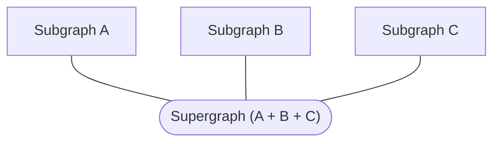

A **supergraph** (also called a federated graph) is a graph composed of multiple **subgraphs**:



Rover commands that interact with supergraphs begin with `rover supergraph`. These commands primarily deal with composition of a **supergraph schema** that adheres to the [supergraph schema specification](https://apollo-specs.github.io/core/draft/pre-0).

> Supergraph schemas are currently in preview and cannot be consumed yet by Apollo tools. Upon the full release of supergraph schemas, the [`@apollo/gateway`](https://www.apollographql.com/docs/federation/gateway/) library will be able to consume a supergraph schema to enable advanced federation features.

## Composing a supergraph schema

You can use the `supergraph compose` command to compose a supergraph schema based on a provided subgraph configuration file:

```bash
rover supergraph compose --config ./supergraph.yaml
```

### Configuration

The `supergraph compose` command's `--config` option expects the path to a YAML file that contains a list of all subgraphs:

```yaml
subgraphs:
  films:
    routing_url: https://films.example.com
    schema: 
      file: ./films.graphql
  people:
    routing_url: https://people.example.com
    schema: 
      file: ./people.graphql
```

The YAML file must specify each subgraph's public-facing URL (`routing_url`), along with the path to its schema (`schema.file`).

> **Important:** Currently, `supergraph compose` only accepts federation-enhanced SDL files, which you can obtain with [`subgraph introspect`](./subgraphs#fetching-via-enhanced-introspection) or [`subgraph fetch`](subgraphs/#fetching-from-apollo-studio) (see also [Using `stdout`](./conventions#using-stdout)).

### Output format

By default, `supergraph compose` outputs a [supergraph schema](https://apollo-specs.github.io/core/draft/pre-0) document to `stdout`. This will be useful for providing the schema as input to _other_ Rover commands in the future.

You can also save the output to a local `.graphql` file like so:

```bash
# Creates prod-schema.graphql or overwrites if it already exists
rover supergraph compose --config ./supergraph.yaml > prod-schema.graphql
```

> For more on passing values via `stdout`, see [Using `stdout`](./conventions#using-stdout).
