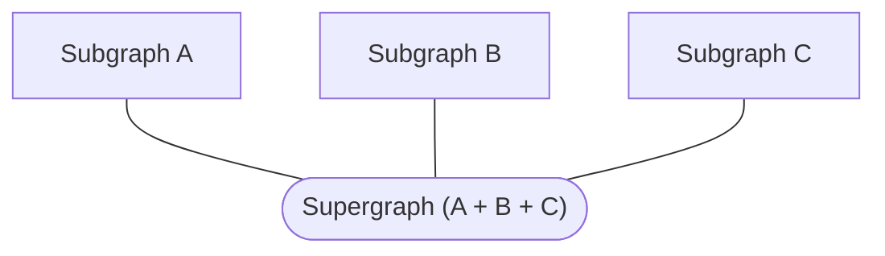

A **supergraph** (also called a federated graph) is a graph composed of multiple **subgraphs**:



Rover commands that interact with supergraphs begin with `rover supergraph`. These commands primarily deal with [supergraph schemas](/federation/federated-types/overview/), which adhere to the [core schema specification](https://specs.apollo.dev/core/v0.2/).

## Composing a supergraph schema

You can use the `supergraph compose` command to compose a supergraph schema based on a provided subgraph configuration file:

```bash
rover supergraph compose --config ./supergraph.yaml
```

### Configuration

The `supergraph compose` command's `--config` option expects the path to a YAML file that contains a list of all subgraphs:

```yaml
subgraphs:
  films:
    routing_url: https://films.example.com
    schema:
      file: ./films.graphql
  people:
    routing_url: https://people.example.com
    schema:
      file: ./people.graphql
```

In the above example, The YAML file specifies each subgraph's public-facing URL (`routing_url`), along with the path to its schema (`schema.file`).

It's also possible to pull subgraphs from various sources and specify them in the YAML file. For example, here is a configuration that specifies schema using Apollo Registry refs (`subgraph`, `graphref`) and subgraph introspection (`subgraph_url`):

```yaml
subgraphs:
  films:
    routing_url: https://films.example.com
    schema:
      file: ./films.graphql
  people:
    routing_url: https://example.com/people
    schema:
      subgraph_url: https://example.com/people
  actors:
    routing_url: https://localhost:4005
    schema:
      graphref: mygraph@current
      subgraph: actors
```

#### Using with Federation 2

To use Rover with a Federation 2 supergraph, you need to add `federation_version: 2` to your YAML configuration file.

```yaml
federation_version: 2
subgraphs:
  films:
    routing_url: https://films.example.com
    schema:
      file: ./films.graphql
```

The first time you run `rover supergraph compose` with Federation 2 on a particular machine, you will need to accept the terms and conditions of the [ELv2 license](https://www.apollographql.com/docs/resources/elastic-license-v2-faq/). On future invocations, Rover remembers that you already accepted the license and will not prompt you again (even if you update Rover).

> ⚠️ **Important:** CI systems wipe away any persisted Rover configuration on each run, and they can't accept the interactive ELv2 prompt. To automatically accept the prompt in CI, do one of the following:
>
> * Set the environment variable `APOLLO_ELV2_LICENSE=accept` in your CI environment.
> * Include `--elv2-license accept` in your `rover supergraph compose` command.
> * Run `yes | rover supergraph compose`

### Output format

By default, `supergraph compose` outputs a [supergraph schema](/federation/federated-types/overview/) document to `stdout`. This will be useful for providing the schema as input to _other_ Rover commands in the future.

You can also save the output to a local `.graphql` file like so:

```bash
# Creates prod-schema.graphql or overwrites if it already exists
rover supergraph compose --config ./supergraph.yaml > prod-schema.graphql
```

> For more on passing values via `stdout`, see [Using `stdout`](./conventions#using-stdout).

#### Gateway compatibility

**Apollo Gateway fails to start up if it's provided with a supergraph schema that it doesn't support.** To ensure compatibility, we recommend that you test launching your gateway in a CI pipeline with the supergraph schema it will ultimately use in production.

The `rover supergraph compose` command generates a supergraph schema by dynamically selecting the proper composition function either from the [`@apollo/federation`](https://www.npmjs.com/package/@apollo/federation) package for Federation 1, or from the [`@apollo/composition`](https://www.npmjs.com/package/@apollo/composition) library for Federation 2. Rover works with _multiple_ versions of composition without needing to build and release a separate version of Rover.

It is recommended that you set `federation_version: 1` or `federation_version: 2` in your YAML configuration file. Rover downloads the latest compatible composition function and uses it automatically. Our aim is to release only backward-compatible changes moving forward.

> **If Rover updates its composition version and causes composition to fail,** you can pin the federation version in your YAML configuration file to ensure that Rover uses the same version each time. For example, setting `federation_version: =2.0.0` ensures that Rover _always_ uses `@apollo/composition@v2.0.0`.
>
> Versions of `supergraph compose` are installed to `~/.rover/bin` if you installed with the `curl | sh` installer, and to `./node_modules/.bin/` if you installed with npm.

If you set `federation_version: 1` or `federation_version: 2`, you can run `rover supergraph compose` with the `--skip-update` flag to prevent Rover from downloading newer composition versions. This can be helpful if you're on a slow network.

#### Pre v0.5.0 Rover

Prior to Rover v0.5.0, `rover supergraph compose` shipped with exactly one version of composition that was compatible with Federation 1. This function was sourced from the [`@apollo/federation`](https://www.npmjs.com/package/@apollo/federation) JavaScript package. Therefore, it was important to keep track of your Rover version and your Gateway version and keep them in sync according to the following compatibility table.

|Rover version|Gateway version|
|---|---|
|<= v0.2.x|<= v0.38.x|
|>= v0.3.x|>= v0.39.x|

## Fetching a supergraph schema from Apollo Studio

> This requires first [authenticating Rover with Apollo Studio](./configuring/#authenticating-with-apollo-studio).

You can use Rover to fetch the supergraph schema of any federated Studio graph and variant it has access to. Run the `supergraph fetch` command, like so:

```bash
rover supergraph fetch my-graph@my-variant
```

> To fetch the API schema instead, use [`graph fetch`](./graphs/#fetching-a-schema). [Learn about different schema types.](/federation/federated-types/overview/)

The argument `my-graph@my-variant` in the example above specifies the ID of the Studio graph you're fetching from, along with which [variant](/studio/org/graphs/#managing-variants) you're fetching.

> You can omit `@` and the variant name. If you do, Rover uses the default variant, named `current`.
